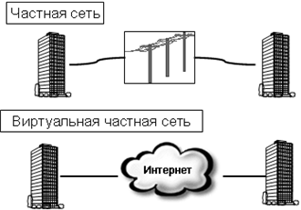
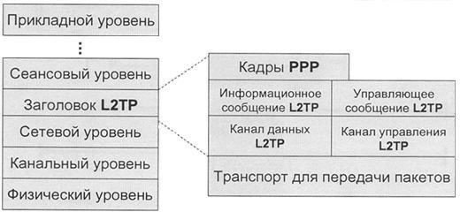
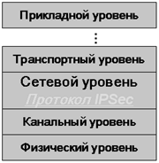
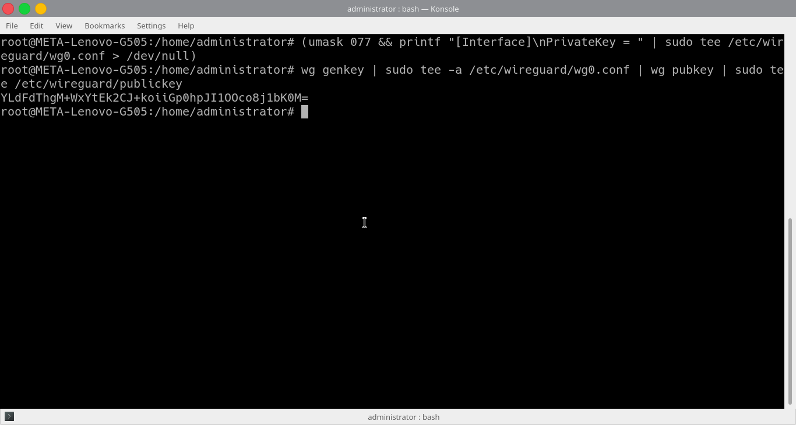
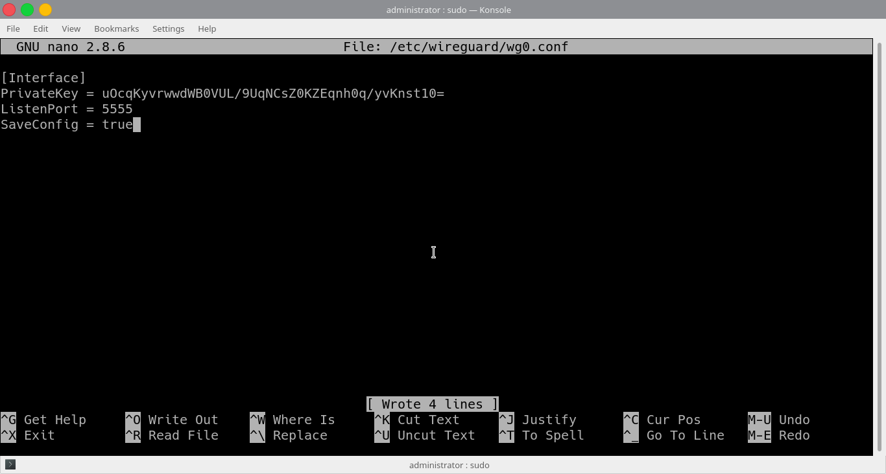

Введение
========

Вопрос защиты информации для людей, пользующихся информационными
технологиями, является одним из самых острых, ибо в наши дни участились
случаи "воровства данных", зачастую влекущие за собой самые неприятные
последствия. Такие инциденты мало приятны как для частного лица, так и
для организации, ведь злоумышленник может, зачастую безнаказанно,
распоряжаться украденной информацией, нанося ущерб человеку или
предприятию, как моральный, так и материальный. Именно поэтому,
технологии, направленные на обеспечение безопасного хранения информации,
непрерывно развиваются. Одним из достижений информационных технологий,
направленных на защиту данных, являются VPN-технологии. VPN (Virtual
Private Network) - это, как исходит из названия, виртуальная частная
сеть, позволяющая обезопасить корпоративные и частные данные и сервисы
от сторонних угроз. Корпоративная VPN – это "наложенная" (виртуальная)
на сеть общего пользования сетевая инфраструктура, ограниченная рамками
предприятия.

В данной курсовой работе будет говориться об использовании
VPN-технологии в корпоративной среде. Далеко не все предприятия способны
позволить себе иметь собственные физические каналы доступа, и здесь на
помощь приходит технология VPN, на основе которой и соединяются все
подразделения и филиалы, что обеспечивает достаточную гибкость и
одновременно высокую безопасность сети, а также существенную экономию
затрат. На предприятии эта сетевая технология весьма полезна не только
ввиду возможности обезопасить корпоративную информацию, но и из-за
возможности отслеживать действия каждого сотрудника, работающего за
компьютером, или пользующимся иными устройством, подключенным к VPN -
сети, а также дает возможность удаленным сотрудникам подключаются к
рабочей сети с помощью этой технологии. При этом их компьютеры,
смартфоны или планшеты виртуально переносятся в офис и подключаются к
сети изнутри. Все вышеперечисленные факторы могут существенно улучшить
продуктивность работы организации и позволить руководителям
контролировать работу сотрудников. Помимо этого, данная технология
довольно проста в использовании: встроенные VPN-клиенты, как правило,
есть во всех актуальных операционных системах. Но все же, не стоит
забывать, что безопасность личных данных также крайне зависима от
добросовестности поставщика услуги VPN, и, в крайне большой степени, от
внимательности пользователя.

Актуальность выбранной мной темы курсовой работы сложно недооценить: VPN
– технология актуальна для использования современными предприятиями, в
первую очередь, с точки зрения защиты информации от несанкционированного
доступа – ни одна фирма не хочет рисковать потерей данных и, как
следствие, денежных средств. Как говорилось выше, данная технология,
обеспечивая безопасность данных, также существенно экономит средства
использующих ее организаций, ибо, будучи крайне надежной, в то же время
достаточно проста в использовании и не требует огромных денежных
вложений. Именно поэтому внедрение VPN в организации является для
владельцев предприятия решением выгодным и продуктивным.

Цель данной курсовой работы – ознакомление с принципами работы
VPN-технологии и ее преимуществами.

Задачами данной курсовой работы являются:

-   рассмотрение применения данной технологии в условиях предприятия;

-   выбор средств реализации данной технологии для практического
    использования, начиная с технического, заканчивая программным
    обеспечением;

-   рассмотрение процесса установки VPN-соединения для нужд фирмы.

Глава 1. Теоретическая часть. Виртуальные частные сети.
=======================================================

Принцип работы технологии
-------------------------

VPN-устройство располагается между внутренней сетью и сетью Интернет на
каждом конце соединения. Когда данные передаются через VPN, они исчезают
в точке отправки и вновь появляются только в точке назначения. Этот
процесс называют «туннелированием», что означает создание логического
"туннеля" в сети Интернет, который соединяет две крайние точки
соединения. Благодаря туннелированию, частная информация становится
невидимой для других пользователей Интернета, что гарантирует
безопасность передачи данных. Прежде чем попасть в "туннель", данные
подвергаются шифрованию: этот процесс обеспечивает их дополнительную
защиту. Протоколы шифрования представлены в широком разнообразии: выбор
зависит от того, какой протокол туннелирования поддерживается тем или
иным VPN-решением. Еще одной важной характеристикой VPN-решений является
диапазон поддерживаемых протоколов аутентификации. Большинство
популярных продуктов работают со стандартами, основанными на
использовании открытого ключа, такими как X.509: получается, усилив свою
виртуальную частную сеть соответствующим протоколом аутентификации,
можно гарантировать, что доступ к защищенным "туннелям" получат только
выбранные группы пользователей.

Каждый субъект/объект VPN характеризуется парой признаков: идентификатор
и ключ шифрования взаимодействия с сервером VPN. Данная пара
генерируется администратором при создании субъекта/объекта. Если
субъектом/объектом VPN выступает компьютер, то идентификатор и ключ
шифрования взаимодействия с сервером VPN устанавливаются на компьютере
администратором при установке клиентской части (в процессе эксплуатации
по усмотрению администратора данные параметры могут быть изменены), если
же субъектом/объектом VPN выступает пользователь, то сгенерированная
администратором пара признаков идентификатор и ключ шифрования
взаимодействия с сервером VPN выдаются пользователю администратором на
внешнем носителе (Flash-устройство, электронный ключ, смарт-карта).

Имея доступ в Интернет, любой пользователь может без проблем
подключиться к сети офиса своей организации. Однако, это не значит, что
общедоступность данных подразумевает их незащищенность. Система
безопасности VPN защищает всю корпоративную информацию от
несанкционированного доступа. Прежде всего, информация передается в
зашифрованном виде. Прочитать полученные данные может лишь обладатель
ключа к шифру. Наиболее часто используемым алгоритмом кодирования
является Triple DES, который обеспечивающий тройное шифрование (168
разрядов) с использованием трех разных ключей.

До момента идентификации субъекта/объекта клиентской частью VPN на
сервере, на компьютере не хранится какой-либо информации о ключах
шифрования виртуальных каналов. Ключи шифрования виртуальных каналов
генерируются сервером при идентификации субъектов/объектов VPN
автоматически, т.е. даже администратор безопасности не обладает ключевой
информацией. Осуществляется это следующим образом. При идентификации
субъекта/объекта VPN на сервере, для идентифицируемого субъекта/объекта
сервером автоматически генерируются ключи шифрования (каждая пара
взаимодействующих субъектов/объектовVPN имеет свой ключ шифрования) с
другими субъектами/объектами VPN. Данная информация (ключи шифрования
данного компьютера с другими активными компьютерами в составе VPN)
сервером в зашифрованном виде передается на идентифицированный компьютер
(идентифицированному пользователю), где хранится в оперативной памяти –
эта информация не доступна пользователю. Одновременно на все остальные
активные (идентифицированные ранее) компьютеры из состава VPN сервером
выдаются сгенерированные ключи шифрования для взаимодействия с вновь
идентифицированным субъектом/объектом. Таким образом, в каждый момент
времени в оперативной памяти идентифицированного компьютера в составе
VPN хранится таблица с ключами шифрования трафика с другими активными
(идентифицированными) компьютерами в составе VPN (для каждой пары этот
ключ свой). Данная таблица пополняется после идентификации каждого
последующего субъекта/объекта. Смена ключа шифрования осуществляется
сервером автоматически при каждой последующей идентификации
субъекта/объекта.

Туннелирование (tunneling), или инкапсуляция (encapsulation), - способ
передачи информации через промежуточную сеть. Такой информацией могут
быть кадры (или пакеты) другого протокола. При инкапсуляции кадр не
передается в сгенерированном узлом-отправителем виде, а снабжается
дополнительным заголовком, содержащим информацию о маршруте, позволяющую
инкапсулированным пакетам проходить через промежуточную сеть (Internet).
На конце туннеля кадры деинкапсулируются и передаются получателю.

В зависимости от используемых протоколов и конечных точек VPN может быть
трех видов:

-   Remote Access, или удаленный доступ, когда создается защищенный
    канал связи между главным офисом и удаленным сотрудником.

-   Intranet, который используется в случае, когда у компании есть
    распределенная сеть филиалов и мобильных офисов. Такой способ
    организации виртуальной сети предполагает установку и использование
    серверов в каждой из точек.

-   Extranet, когда доступ во внутреннюю сеть организации
    предоставляется внешним пользователям, при этом весьма ограничивая
    их возможности по просмотру файлов.

-   Клиент — Сервер позволяет организовать обмен файлами между
    несколькими логическими сегментами внутри одного физического
    (например, деление компании на отделы).

Протоколы VPN
-------------

В данном пункте будут рассмотрены протоколы, применяемые в
VPN-технологиях и их преимущества.

Один из самых широко используемых - PPTP (Point-to-Point Tunneling
Protocol) - туннельный протокол типа «точка-точка», позволяющий
компьютеру устанавливать защищённое соединение с сервером за счёт
создания специального туннеля в стандартной, незащищённой сети. Протокол
PPTP позволяет инкапсулировать пакеты PPP в пакеты протокола Internet
Protocol (IP) и передавать их по сетям, использующим протокол IP, в том
числе и Интернет.

PPTP обеспечивает безопасную передачу данных от удаленного клиента к
отдельному серверу предприятия путем генерирования в сети TCP/IP частной
виртуальной сети. PPTP может также использоваться для организации
туннеля между двумя локальными сетями. PPTP работает, устанавливая
обычную PPP-сессию с противоположной стороной с помощью протокола
Generic Routing Encapsulation (GRE). Второе соединение на TCP-порту 1723
используется для инициации и управления GRE-соединением. Для обеспечения
безопасности PPTP-трафика может быть использован протокол MPPE. Для
аутентификации клиентов могут использоваться различные механизмы,
наиболее безопасные из них — MSCHAPv2 и EAP-TLS.

Для обеспечения работы клиента по протоколу PPTP, необходимо установить
IP-соединение с туннельным сервером PPTP. Все передаваемые по этому
соединению данные могут быть защищены и сжаты. По туннелю PPTP могут
передаваться данные различных протоколов сетевого уровня (TCP/IP,
NetBEUI и IPX).

Преимущества протокола PPTP:

-   использование частного IP-адреса: пространство IP-адресов частной
    сети не координируется с пространством глобальных (внешних) адресов;

-   поддержка множества протоколов: можно осуществлять доступ к частным
    сетям, использующим различные комбинации TCP/IP или IPX;

-   безопасность передачи данных: для предотвращения
    несанкционированного подключения, используются протоколы и политики
    обеспечения безопасности сервера удаленного доступа; 

-   возможность использования аутентификации и защиты данных при
    передаче пакетов через Интернет.

L2TP (Layer 2 Tunneling Protocol) - протокол туннелирования 2 уровня,
или канального уровня. Объединяет протокол L2F (Layer 2 Forwarding),
разработанный компанией Cisco, и протокол PPTP. Позволяет организовывать
VPN с заданными приоритетами доступа, однако не содержит в себе средств
для защиты данных и механизмов аутентификации.

Данный протокол использует сообщения двух типов: управляющие и
информационные. Управляющие сообщения используются для установления,
поддержания и ликвидации туннелей и вызовов. Для обеспечения доставки
ими используется надежный управляющий канал протокола L2TP.
Информационные сообщения используются для инкапсулирования кадров PPP,
передаваемых по туннелю. При потере пакета он не передается повторно.

Структура протокола описывает передачу кадров PPP и управляющих
сообщений по управляющему каналу и каналу данных протокола L2TP. Кадры
PPP передаются по ненадежному каналу данных, предварительно дополняясь
заголовком L2TP, а затем - по транспорту для передачи пакетов, такому
как Frame Relay, ATM и т.п. Управляющие сообщения передаются по
надежному управляющему каналу L2TP с последующей передачей по тому же
транспорту для пересылки пакетов.

Все управляющие сообщения должны содержать порядковые номера,
используемые для обеспечения надежной доставки по управляющему каналу.
Информационные сообщения могут использовать порядковые номера для
упорядочивания пакетов и выявления утерянных пакетов.

Преимущества протокола L2TP:

-   разнообразие протоколов: в виду использования кадрирования PPP,
    удаленные пользователи могут использовать для доступа к
    корпоративному узлу большое количество различных протоколов, таких
    как IP, IPX и т.д;

-   создание туннелей в различных сетях: L2TP может работать как в сетях
    IP, так и в сетях ATM, Frame Relay и др;

-   безопасность передачи данных: при этом, пользователь не должен иметь
    никакого специального программного обеспечения;

-   возможность аутентификации пользователей.

IPSec (IP Security) - набор протоколов, относящихся к обеспечению защиты
данных при транспортировке IP-пакетов. IPSec также включает в себя
протоколы для защищённого обмена ключами в сети Интернет. Протоколы
IPSec работают на сетевом уровне (уровень 3 модели OSI).

Протоколы семейства IPSec могут использоваться для защиты либо всех
полезных данных IP-пакета, либо данных протоколов верхнего уровня в поле
полезных данных IP-пакета. Это различие определяется выбором двух
различных режимов протокола IPSec: транспортного режима или туннельного
режима.

Транспортный режим в основном используется хостом IP для защиты
генерируемых им самим данных, а туннельный режим используется шлюзом
безопасности для предоставления услуги IPSec другим машинам, не имеющим
функций IPSec. Однако функции хоста IPSec и шлюза безопасности могут
выполняться одной и той же машиной. Оба протокола IPSec, AH и ESP, могут
выполняться в транспортном или туннельном режиме.

IPSec VPN оптимален для объединения сетей разных офисов через Интернет.

SSL (Secure Socket Layer) - протокол защищенных сокетов, обеспечивающий
безопасную передачу данных по сети Интернет. При его использовании
создается защищенное соединение между клиентом и сервером.

SSL использует защиту данных с открытым ключом для подтверждения
подлинности передатчика и получателя. Поддерживает надёжность передачи
данных за счёт использования корректирующих кодов и безопасных
хэш-функций.

SSL использует RC4, MD5, RSA и другие алгоритмы защиты данных.

SSL использует два ключа для защиты данных - открытый ключ и закрытый
или частный ключ известный только получателю сообщения.

На сегодняшний день, в сети Интернет можно встретить множество сайтов на
которых используется протокол SSL для обеспечения безопасности
пользовательских данных (например, веб-сайты предоставляющие
коммерческие и банковские сервисы). Практически все самые популярные
браузеры, почтовые клиенты и интернет-приложения поддерживают работу с
протоколом SSL. Для доступа к страницам, защищённым протоколом SSL, в
URL вместо обычного префикса http, как правило, применяется префикс
https (порт 443), указывающий на то, что будет использоваться
SSL-соединение.

SSL также может обеспечить защиту протоколов прикладного уровня (уровень
7 модели OSI), например, таких как POP3 или FTP. Для работы SSL
требуется, чтобы на сервере имелся SSL-сертификат.

Безопасное соединение между клиентом и сервером при использовании SSL
выполняет две функции - аутентификацию и защиту данных.

SSL состоит из двух уровней. На нижних уровнях (уровни 4-5)
многоуровневого транспортного протокола (например, TCP) он является
протоколом записи и используется для инкапсуляции (то есть формирования
пакета) различных протоколов. Для каждого инкапсулированного протокола
он обеспечивает условия, при которых сервер и клиент могут подтверждать
друг другу свою подлинность, выполнять защиту передаваемых данных и
производить обмен ключами, прежде чем протокол прикладной программы
начнет передавать и получать данные.

Преимущества протокола SSL:

-   Простота использования;

-   Нет необходимости в дополнительном программном обеспечении;

-   Безопасный удаленный доступ.

SSL VPN оптимален для подключения удаленных пользователей к ресурсам
локальной сети офиса через Интернет.

Цель и назначение корпоративной VPN
-----------------------------------

Итак, Виртуальная Частная Сеть, или VPN – это технология, обеспечивающая
закрытую от доступа извне связь логической сети поверх частной или
публичной, для использования которой нужен высокоскоростной интернет.
Как и все явления в IT, технология VPN не сразу появилась в том виде,
что мы наблюдаем в наши дни.

История появления VPN тесно связана с услугой Centrex в телефонных
сетях. Само понятие "Centrex" появилось в середине шестидесятых ХХ века
в США, и считалось обобщенным наименованием способа предоставления услуг
деловой связи абонентам нескольких организаций, основываясь на совместно
используемом оборудовании системы корпоративной телефонии PBX (Private
Branch Exchange). После внедрения внедрения в США и Канаде станций
телефонии с программным управлением, термин приобрел иной смысл и стал
означать способ предоставления деловым абонентам дополнительных услуг
телефонной связи, эквивалентных услугам PBX, на базе модифицированных
станций сети общего пользования. Одним из основных преимуществ Centrex
являлось то, что фирмы и компании, при создании выделенных корпоративных
сетей, экономили значительные средства, необходимые на покупку, монтаж и
эксплуатацию собственных станций. Используя для связи между собой
ресурсы и оборудование сети общего пользования, абоненты Centrex, тем не
менее, сами образовывали так называемые замкнутые группы пользователей
CUG (Closed Users Group) с ограниченным доступом извне. С целью
минимизировать ограничения, свойственные Centrex, специалистами была
выдвинута идея VPN. Эта технология предполагалась, как объединение
пользователей одной корпоративной сети, удаленных друг от друга. При
этом возможно распределение ресурсов VPN по разным станциям местной
сети, которые оснащены функциями Centrex и имеют одну или несколько CUG
в зоне обслуживания. К тому же в станцию можно включить и PBX,
принадлежащие непосредственно владельцу VPN, и линии любых обычных
частных абонентов. Таким образом, VPN можно представить, как объединение
CUG, составляющих одну корпоративную сеть и находящихся на удалении друг
от друга.

В наши дни, под основной целью виртуальной частной в сети на предприятии
следует понимать максимально возможное обособление потока информации
организации (то есть, определенной группы пользователей) от потока
данных других пользователей общей сети.

Соответственно, назначением сети, реализуемой с помощью технологии VPN,
является непрерывное обеспечение указанной обособленности данных,
которую можно разделить на следующие подзадачи, решаемые при помощи
данной технологии:

-   Конфиденциальность — гарантия того, что данные не будут просмотрены
    третьими лицами.

-   Целостность — обеспечение сохранности передаваемой информации.

-   Доступность — санкционированные пользователи должны иметь
    возможность подключения к VPN постоянно.

Требования к корпоративной VPN
------------------------------

Хранение и обработка корпоративной информации в рамках виртуальной сети
требует ее защиты на должном уровне. Эта защита состоит, в первую
очередь, из реализации политики разграничения доступа к корпоративным
ресурсам, путем создания своеобразной "иерархии" среди пользователей, и
в криптографической защите виртуальных каналов связи.

Очень важно, чтобы все задачи администрирования, ровно как в сфере
установления политики разграничения доступа к корпоративным ресурсам,
так и в части реализации ключевой политики (создания и распространения
ключей шифрования виртуальных каналов), должны решаться непосредственно
администратором безопасности, обладающим достаточными знаниями в
предметной области. Помимо этого, рядовой пользователь должен быть
исключен из схемы администрирования – он должен работать в корпоративной
сети "под принуждением" администратора – должен общаться только с теми
пользователями (или компьютерами, или другими устройствами), с которыми
ему разрешено администратором, при этом должен обмениваться с ними
данными только в том виде (открытыми, либо зашифрованными), в котором
ему разрешено администратором. Как следствие, шифрование виртуальных
каналов должно осуществляться автоматически ("под принуждением")
"прозрачно" для пользователя, ключ шифрования пользователя
(предоставляемый ему администратором) не должен позволять нарушить
пользователю конфиденциальность данных при их хищении.

Кроме того, при построении корпоративной сети с помощью технологии VPN,
следует учитывать и общие требования к корпоративным сетям. Такими
требованиями являются:

-   Гибкость — способность сети к адаптации и развитию, а также к
    приспособлению к новым условиям;

-   Надежность — возможность функционирования сети без искажения
    информации, потери данных ввиду различных причин технического
    характера;

-   Эффективность — способность сети, учитывая выделенные ей ресурсы,
    решать возложенные на нее задачи в минимальные сроки;

-   Безопасность — свойство системы, в силу которого посторонние лица не
    имеют доступа к информационным ресурсам предприятия, кроме тех,
    которые для них предназначены. Соответствие данному требованию
    достигается с помощью различных методов контроля и разграничения
    доступа к информационным ресурсам. Данное требование является одним
    из ключевых при применении VPN, так как именно эта технология
    направлена на обеспечение защиты корпоративной информации.

Сетевое обеспечение корпоративной VPN
-------------------------------------

Основные компоненты VPN реализуют совокупность требований по
производительности, безопасности, а также способности к взаимодействию.
То, насколько правильно реализована архитектура VPN, зависит от
правильности определения требований. В определение требований следует
включить следящие пункты:

-   Время, в течение которого необходимо обеспечивать защиту данных;

-   Число одновременных соединений пользователей;

-   Предполагаемые типы соединений пользователей (например, сотрудники,
    работающие в офисе или удаленно);

-   Число соединений с удаленным сервером;

-   Типы сетей VPN, которым понадобится соединение;

-   Ожидаемый объем входящего и исходящего трафика на удаленных узлах;

-   Политика безопасности и конфиденциальности, определяющая
    соответствующие настройки;

При разработке системы зачастую нужно указывать дополнительные
требования, связанные с местоположением сотрудников, работающих удаленно
из разных мест, например, находясь в командировке (например, узлы в
других организациях или в номерах отелей), а также типы служб, которые
будут работать через VPN.

Техническое обеспечение VPN
---------------------------

Сеть VPN состоит из четырех основных компонентов: сервер VPN, алгоритмов
шифрования, система аутентификации, протокол VPN.

Сервер VPN - это компьютер, на который возложена роль конечного узла
соединения VPN. Данный сервер должен обладать техническими
характеристиками, достаточными для поддержки ожидаемой нагрузки. Большая
часть производителей программного обеспечения VPN должна предоставлять
рекомендации по поводу производительности процессора и конфигурации
памяти, в зависимости от числа одновременных VPN-соединений. Предприятию
необходимо обеспечивать наличие в своих филиалах средств с
соответствующими параметрами, а также позаботиться об их дальнейшей
модернизации.

Алгоритм шифрования, используемый в VPN, должен быть стандартным мощным
алгоритмом. Систем шифрования достаточно много, а потому могут
возникнуть трудности при выборе такой системы. В целом, все стандартные
и мощные алгоритмы могут эффективно использоваться при построении VPN.
Различные производители отдают предпочтение различным алгоритмам, в
зависимости от ограничений реализации продукта, аспектов, связанных с
лицензированием, и предпочтений по программированию. Приобретая
программный пакет VPN, следует выслушать комментарии специалистов и
убедиться в том, что производитель использует мощный алгоритм
шифрования.

Третьим компонентом архитектуры VPN является система аутентификации.
Система эта должна быть двухфакторной. Пользователи могут проходить
аутентификацию с использованием того, что они знают, того, что у них
есть или с помощью данных о том, кем они являются.

Протокол VPN определяет, каким образом система VPN взаимодействует с
другими системами в интернете, а также уровень защищенности трафика.
Если организация использует VPN только для внутреннего информационного
обмена, вопрос о взаимодействии можно оставить без внимания. Однако если
организация использует VPN для соединения с другими организациями,
собственные протоколы использовать, вероятнее всего, не удастся.
Протокол VPN оказывает влияние на общий уровень безопасности системы.
Причиной этому является тот факт, что протокол VPN используется для
обмена ключами шифрования между двумя конечными узлами. Если этот обмен
не защищен, злоумышленник может перехватить ключи и затем расшифровать
трафик, сведя на нет все преимущества VPN.

Глава 2. Практическая часть. Проектирование безопасного интернет соединения между организациями с использованием VPN
====================================================================================================================

Задача
------

ООО «Кузнецов Двери» — компания по производству дверей с кодовым замком. Отдел производства кодовых замков (далее ОПКЗ), которые устанавливаются в отделе установки кодовых замков (далее ОУКЗ). При передаче готовых кодовых замков из ОПКЗ в ОУКЗ необходимо безопасно передать цифровой ключ, который генерируется на специализированной машине при выпуске кодового замка, его не должен видеть никто, кроме конечного владельца двери. Для решения поставленной задачи необходимо создать VPN сервер в котором будет реализованна защищенная передача информации. В случае с «Кузнецов Двери» требуется съэкономить бюджет и максимально сократить сроки установки безопасного соединения, ведь данные не могут передаваться в легко читаемом формате, через общую ЛВС предприятия.

Изготовление, блокировка под шифрованный ключ происходит в ОПКЗ. Шифрованный ключ представляет представляется в виде последовательности 12 символов, случайно сгенерированные в момент прошивки кодового замка. Шифрованный ключ представляет из себя 12 символов кодировки UTF-8, а значит весит 96 бит. Хранится на памяти кодового замка. Для открытия двери необходимо ввести 12 символов, которые будут интерпретированы в биты и сравнены с последовательностью хранящейся в памяти устройства. При полном совпадении дверь будет разблокирована и открыта, в ином случае останется заблокированной и будет предложена новая попытка ввести ключ.

За прошивку кодовых замков отвечает машина которая заносит в память сгенерированный ключ. Копию ключа вместе с серийным ключом нужно безопасно отправить на сервер хранения в ОУКЗ. Конечный владелец получает ключ в единственном экземпляре на пластиковой карте, которую рекомендуется уничтожить после того как владелец запомнит ключ. Это показывает отношение компании к безопасности данных и подтверждает необходимость в VPN соединении.

Передача данных
---------------

В тестовом режиме (без безопасного VPN соединения) ввод данных на отправляющий сервер ОПКЗ приходит команда обратится к серверу ОУКЗ в формате, изображенном на рисунке 1. Сервер ОУКЗ работает на серверном языке PHP. Он записывает в базу данных ключ обозначенный символом X и серийный номер Y в формате обращения (см. рисунок 1). Ключ и серийный номер замка предоставляется устройством, которое прошивает кодовые замки. Сервер сам переводит эти данные в запрос в формате, изображенном на рисунке 1.

Рисунок 1. Формат запроса к серверу ОУКЗ

Компания уже разработала собственную систему автоматизации на PHP. Сервер считывает данные запроса. Принимающий сервер ОУКЗ, кроме приема данных и их хранения, выполняет выпуск пластиковой карты по запросу оператора, когда кодовый замок будет успешно установлен. Готовая дверь упаковывается вместе с пластиковой картой и отправляется на реализацию.

Для осуществления запроса необходимо иметь curl на сервере осуществляющем запрос к серверу ОУКЗ. CURL — кроссплатформенная служебная программа командной строки, позволяющая взаимодействовать с множеством различных серверов по множеству различных протоколов с синтаксисом URL. При ее помощи нам будет достаточно просто написать в консоли:

curl http://89.169.89.11/keystore/index.php?

После знака вопрос необходимо указать ключ от замка и его серийный номер.

Конфигурация серверов предприятия
---------------------------------

Предприятия должно иметь 2 сервера, являющиеся модернизированными ПЭВМ. Для любой связи с устройствами используется ПО разработанное на предприятии ранее. Поскольку ПО для связи внутри предприятия не прихотливо, выбрано создать создать одноранговую VPN сеть между новыми ЭВМ. Возможно создание и отдельного VPN сервера, но данный вариант является очень нетривиальным решением. Одельный сервер создается также как и одноранговая VPN сеть между двумя серверами. Для обеспечения повышенной безопасности, отказоустойчивости, а также в целях экономии средств предприятия на VPN сервер на будет установлена операционная система Linux Ubuntu 17 с графической средой LXDE. Эта ОС имеет следующие требования к ЭВМ, изложенный в таблице 1.

Таблица 1

Системные требования Ubuntu 17 LXDE

  |Характеристика    |Минимум                                |Рекомендация                            |
  |------------------|---------------------------------------|----------------------------------------|
  |Оперативная память|1Гб                                    |4Гб                                     |
  |Процессор         |Одноядерный процессор с частотой 1,3GHz|Двухъядерный процессор с частотой 1,6GHz|
  |Объем памяти      |25Гб                                   |Более 80Гб                              |

Для выбора комплектующих будем отталкиваться от системных требований ОС изложенных в таблице 1, а также общими требованиями к VPN серверу для предприятия в 2018 году. Начнем с выбора процессора. Для ПЭВМ пользуются популярностью процессоры компании Intel. Но для сервера экономичнее и практичнее окажутся AMD. В ходе анализа рынка был выбран процессор AMD FX-4300 OEM: соккет AM3+, 4 ядра с частотой 3.8 ГГц. Цена в розницу 3399 рублей. Поиск среди материнских плат с соккетом AM3+ привел к лидеру по соотношению цена-качество, материнская плата ASUS M5A78L-M PLUS/USB3: соккет AM3+, 4 слота оперативной памяти DDR3 с частотой 2000 МГц. Цена в розницу 3999 рублей. Охладительная система для процессора CoolerMaster CP6-9HDSA-0L-GP, стоимостью 799 рублей. Оперативная память AMD Radeon R5, специальной версии ориентированной на предприятие, цена 4399 рублей. Для постоянного хранения данных выберем гибкий накопитель Sandisk SSD Plus, поскольку он имеет высокую отказоустойчивость и производительность, а также емкость 120 Гб, это говорит о его оптимизации для предприятия, цена 2799 рублей. Блок питания Aerocool VX-600 мощностью в 600 ватт отлично подходит под конфигурацию компьютера, способен спокойно удовлетворить запросам питания остальных компонентов ПЭВМ, цена 2099 рублей. Корпус CoolerMaster MasterBox MB600L подходит под форм-фактор комплектующих, цена 3100 рублей. В итоге получилась сумма 20594 рубля.

Программное обеспечение для создания VPN соединения
---------------------------------------------------

После выбора ОС Linux появляется огромный выбор ПО для создания VPN соединения. Передовым и современным ПО в этой категории является WireGuard. WireGuard — результат исследований автора проекта Джейсона Доненфилда, главы компании Edge Security. Продукт со встроенной криптографией, одновременно простой в использовании и в реализации. В финальном выпуске весь проект имеет чуть более 4000 строк кода, что существенно выделяет его среди остальных решений. Например, его код легче проанализировать чем OpenVPN, а значит модернизация не вызовет особых затруднений. Не смотря на то что это решание моложе остальных, WireGuard имеет ряд уверенных преимуществ. Хотя сам проект развивается уже несколько лет и прошел стадию рецензирования криптографии, его не внедряют в основное ядро, что позволило бы вытеснить устаревшие и менее продвинутые решения, как OpenVPN.

VPN-соединение инициализируется путем обмена открытыми ключами и напоминает подход, применяемый в SSH. Это называется рукопожатием. Все остальное прозрачно обрабатывается WireGuard, нет необходимости беспокоиться о ключах, роутинге, контроле состояния и прочем, это все забота WireGuard. Возможно использование симметричного шифрования, но это потребует чуть больших настроек. Маршрутизация производится по ключам шифрования, для этого к каждому сетевому интерфейсу привязывается закрытый ключ. Для обновления ключей рукопожатие происходит через определенное время или по сигналу, что ключи устарели. Для согласования ключей и соединения вместо собственного демона в пространстве пользователя используется механизм Noise\_IK из Noise Protocol Framework.

Noise Protocol Framework это быстрый, безопасный и простой каркас для проектирования и разработки протоколов шифрования. Благодаря этому каркасу реализован WireGuard, он использует такие компоненты каркаса как взаимную, так и факультативную аутентификацию, скрытие информации, прямую пересылку, нулевое шифрование с обратным проходом и другие расширенные функции.

Установка WireGuard
-------------------

Для того чтобы установить WireGuard нам необходимо в первую очередь установить и настроить ОС Линукс. Для этого необходимо записать установочный образ lubuntu.amd64.iso на съёмный накопитель. В нашем случае это флеш карта памяти на 32Гб. Для записи образа диска на загрузочную карту используем бесплатное ПО UltraISO. Для записи нужно выбрать пункт в меню «Самозагрузка», и далее «Записать образ самозагрузки». В появившемся окне выбираем установленную карту, устанавливаем метод записи — HDD+, включаем параметр «Проверка» и выполняем запись образа диска нажатием на кнопку «Выполнить».

Устанавливаем созданный нами загрузочный диск в собранный сервер. Открываем конфигурацию BIOS, в которой необходимо указать порядок загрузки — на первом месте должна быть установлен пункт «USB-HDD». Теперь при запуске машина входит в загрузчик GRUB2. Запускаем систему в формате live.

Система Lubuntu запущена в тестовом режиме. Теперь на рабочем столе необходимо запустить ярлык «Install». Запустится графическая программа для установки ОС. Необходимо указывать информацию о вашем языке, часовом поясе, раскладке и типу установки. В типе установки нужно выбрать «Отчистить диск и установить систему». Далее программа установки предложит создать пользователя. Указываем в логин «root», пароль «123123\#», имя компьютера «VPNgeneral». По окончании установки перезагружаем машину командой reboot. Не запуская ОС, вначале меняем порядок загрузки в BIOS. На первую позицию устанавливаем «harddisk». Сохраняем параметры, извлекаем карту с установочной системой и запускаем ОС с жесткого диска.

Для установки WireGuard нам необходима программа для управления пакетами для Линукс. Она предустановлена в выбранной нами системе. Вызывается через консоль и называется apt. Через этот менеджер пакетов мы должны обновить список пакетов в репозиториях, это необходимо, чтобы установить все зависимости автоматически и не беспокоится о совместимости библиотек, установленных системой и приложением wireguard. Команда должна быть выполнена в режиме суперпользователя. Для этого вызываем консоль комбинацией клавиш «CTRL+ALT+T». Входим в систему по логину и паролю: «root» и «123123\#». Выполняем команду sudo su. Опять указываем тот же пароль. Запускаем обновление репозиториев командой apt update. Далее необходимо добавить официально доступный репозиторий команды разработчиков WireGuard командой add-apt-repository ppa:wireguard/wireguard. Далее повторяем обновление репозиториев командой apt update. Теперь выполняем установку библиотеки и основной части приложения командой apt install wireguard-dkms wireguard-tools.

В случае корректной установки apt просто вернет к виду командной строки интерпретатора Bash. Аутентификация всех одноуровневых участников VPN WireGuard происходит на основе шифрования по открытым ключам. Связи между новыми хостами устанавливаются путем обмена открытыми ключами и выполнения минимальной конфигурации.

Чтобы сгенерировать закрытый ключ и записать его непосредственно в конфигурационный файл WireGuard, введите две команды с рисунка 3. Первая команда записывает исходное содержимое конфигурационного файла в /etc/wireguard/wg0.conf. Значение umask в суб-оболочке позволяет создать файл с ограниченными разрешениями, не затрагивая обычную среду. Вторая команда генерирует закрытый ключ с помощью команды wg и записывает ее непосредственно в конфигурационный файл с ограниченным доступом. Затем ключ передается обратно в команде wg pubkey, чтобы получить связанный с ним открытый ключ, который записывается в /etc/wireguard/publickey. После настройки серверы должны обменяться открытыми ключами.

Рисунок 2. Команда для генерации ключа

Теперь необходимо открыть конфигурационный файл в редакторе: sudo nano /etc/wireguard/wg0.conf. Внутри, в разделе \[Interface\], находится только что сгенерированный закрытый ключ. Этот раздел содержит конфигурацию для локальной стороны соединения. Здесь нужно определить IP-адрес VPN, который будет использовать этот узел, и порт, который он будет прослушивать для соединений с одноранговыми узлами. Для начала добавьте строки ListenPort и SaveConfig. Это определит порт, который будет прослушивать WireGuard. Это может быть любой свободный порт, но мы выберем порт 5555. SaveConfig имеет значение true, чтобы сервис wg-quick мог автоматически сохранять свою активную конфигурацию в этом файле при завершении работы. Результат записи на рисунке 3.

Рисунок 3. Редактор конфигурации

Затем добавьте на каждый сервер уникальное определение Address, чтобы сервис wg-quick мог установить сетевую информацию при вызове интерфейса WireGuard. В руководстве в качестве адресного пространства VPN используется подсеть 10.0.0.0/24. Для каждого компьютера нужно выбрать уникальный адрес в этом диапазоне (от 10.0.0.1 до 10.0.0.254) и указать адрес и подсеть, используя нотацию CIDR.

CIDR — бесклассовая адресация, метод IP-адресации, позволяющий гибко управлять пространством IP-адресов, не используя жёсткие рамки классовой адресации. Использование этого метода позволяет экономно использовать ограниченный ресурс IP-адресов, поскольку возможно применение различных масок подсетей к различным подсетям.

Когда параметр SaveConfig включен, сервис wg-quick будет переписывать содержимое /etc/wireguard/wg0.conf при каждом завершении работы. Чтобы изменить конфигурацию WireGuard, нужно либо отключить сервис wg-quick до изменения файла /etc/wireguard/wg0.conf, либо же внести поправки с помощью команды wg, не отключая сервис (они сохранятся при завершении работы сервиса). Любые изменения, внесенные в файл конфигурационный файл во время работы сервиса, будут перезаписаны wg-quick.

Затем добавьте на каждый сервер уникальное определение Address, чтобы сервис wg-quick мог установить сетевую информацию при вызове интерфейса WireGuard. В руководстве в качестве адресного пространства VPN используется подсеть 10.0.0.0/24. Для каждого компьютера нужно выбрать уникальный адрес в этом диапазоне (от 10.0.0.1 до 10.0.0.254) и указать адрес и подсеть, используя нотацию CIDR.

Первый сервер получит адрес 10.0.0.1, что в CIDR нотации выглядит как 10.0.0.1/24. Это частный ip адрес в локальной вычислительной сети.

\[Interface\]

PrivateKey = generated\_private\_key

ListenPort = 5555

SaveConfig = true

Address = 10.0.0.1/24

Второй сервер получает адрес 10.0.0.2, что в CIDR нотации выглядит как 10.0.0.2/24

\[Interface\]

PrivateKey = generated\_private\_key

ListenPort = 5555

SaveConfig = true

Address = 10.0.0.2/24

Позже с помощью команды wg можно добавить в конфигурационный файл информацию о других одноуровневых хостах. Как упоминалось выше, сервис wg-quick с включенным параметром SaveConfig будет записывать информацию об одноуровневых хостах в файл любым способом.

Чтобы попробовать оба способа определения одноуровневых хостов, создайте раздел \[Peer\] в конфигурационном файле второго сервера. Конфигурационный файл первого сервера можно сохранить и закрыть.

Это нужно выполнить на втором сервере 2 (адрес 10.0.0.2). Создайте раздел под названием \[Peer\] после раздела \[Interface\]. В PublicKey укажите значение открытого ключа первого сервера. Вы можете найти это значение, набрав на первом сервере команду:

cat /etc/wireguard/publickey

Также в AllowedIPs нужно установить IP-адреса, действительные в туннеле. Поскольку вы знаете IP-адрес, который использует первый сервер, введите его и добавьте /32 в конце, чтобы указать диапазон.

\[Interface\]

. . .

\[Peer\]

PublicKey = public\_key\_of\_first\_server

AllowedIPs = 10.0.0.1/32

В Endpoint введите общедоступный IP-адрес первого сервера и порт, который прослушивает WireGuard (в этом примере это порт 5555). WireGuard обновит это значение, если оно получит законный трафик от этого узла по другому адресу, что позволит VPN адаптироваться к условиям роуминга. Начальное значение нужно, чтобы сервер мог инициировать контакт.

\[Interface\]

. . .

\[Peer\]

PublicKey = public\_key\_of\_first\_server

AllowedIPs = 10.0.0.1/32

Endpoint = public\_IP\_of\_first\_server:5555

Запуск VPN и подключение к одноуровневым узлам. Теперь нужно запустить WireGuard на каждом сервере и настроить взаимодействие между двумя одноуровневыми узлами. Настройка брандмауэра и запуск VPN:

Откройте порт WireGuard в брандмауэре на каждом сервере.

sudo ufw allow 5555

Запустите сервис wg-quick с помощью файла интерфейса wg0.

sudo systemctl start wg-quick@wg0

Это запустит сетевой интерфейс wg0. Чтобы убедиться в этом, введите:

ip addr show wg0

6: wg0: &lt;POINTOPOINT,NOARP,UP,LOWER\_UP&gt; mtu 1420 qdisc noqueue state UNKNOWN group default qlen 1

link/none

inet 10.0.0.1/24 scope global wg0

valid\_lft forever preferred\_lft forever

Мы можем использовать инструмент wg для просмотра информации об активной конфигурации VPN:

sudo wg

На сервере без определения одноуровневых узлов вывод будет выглядеть примерно так:

interface: wg0

public key: public\_key\_of\_this\_server

private key: (hidden)

listening port: 5555

На сервере, где одноуровневые узлы уже определены, вывод будет выглядеть так:

interface: wg0

public key: public\_key\_of\_this\_server

private key: (hidden)

listening port: 5555

peer: public\_key\_of\_first\_server

endpoint: public\_IP\_of\_first\_server:5555

allowed ips: 10.0.0.1/32

Чтобы завершить соединение, нужно добавить информацию второго сервера на первый сервер, используя команду wg.

Добавление отсутствующей информации о сверке в командной строке

На первом сервере введите информацию о хосте вручную, используя следующий формат. Открытый ключ второго сервера можно найти в выводе sudo wg (на втором сервере):

sudo wg set wg0 peer public\_key\_of\_second\_server endpoint public\_IP\_of\_second\_server:5555 allowed-ips 10.0.0.2/32

Вы можете подтвердить, что информация теперь находится в активной конфигурации, снова введя sudo wg на первом сервере:

sudo wg

interface: wg0

public key: public\_key\_of\_this\_server

private key: (hidden)

listening port: 5555

peer: public\_key\_of\_second\_server

endpoint: public\_IP\_of\_second\_server:5555

allowed ips: 10.0.0.2/32

Теперь соединение точка-точка должно быть доступно. Попробуйте выполнить проверку VPN-адреса второго сервера с первого:

ping -c 3 10.0.0.2

PING 10.0.0.2 (10.0.0.2) 56(84) bytes of data.

64 bytes from 10.0.0.2: icmp\_seq=1 ttl=64 time=0.635 ms

64 bytes from 10.0.0.2: icmp\_seq=2 ttl=64 time=0.615 ms

64 bytes from 10.0.0.2: icmp\_seq=3 ttl=64 time=0.841 ms

--- 10.0.0.2 ping statistics ---

3 packets transmitted, 3 received, 0% packet loss, time 1998ms

rtt min/avg/max/mdev = 0.615/0.697/0.841/0.102 ms

Если все работает правильно, вы можете сохранить конфигурацию на первом сервере в файл /etc/wireguard/wg0.conf, перезапустив сервис:

sudo systemctl restart wg-quick@wg0

Если вы хотите добавить туннель в автозагрузку, вы можете включить сервис на каждом компьютере с помощью команды:

sudo systemctl enable wg-quick@wg0

Теперь туннель VPN должен автоматически запускаться всякий раз, когда загружается машина.

Расширение сети
---------------

WireGuard стремится быть таким же простым, как SSH. Соединение устанавливается путем обмена открытыми ключами между сервером и клиентом точно так же, как ключи SSH, и только клиент с его открытым ключом, присутствующим в его файле конфигурации сервера, считается авторизованным. WireGuard устанавливает стандартные сетевые интерфейсы (такие как wg0 и wg1), которые ведут себя так же, как обычно используемый интерфейс eth0. Это позволяет настраивать и управлять интерфейсами WireGuard с использованием стандартных инструментов, таких как ifconfig и ip.

Создайте пару частных и открытых ключей для сервера WireGuard:

umask 077

wg genkey | tee privatekey | wg pubkey &gt; publickey

Это сохранит как частные, так и открытые ключи в вашем домашнем каталоге; они могут быть просмотрены с cat privatekey и cat publickey соответственно.

Откройте /etc/wireguard/wg0.conf в текстовом редакторе и добавьте следующий контент, заменив &lt;Private Key&gt; на сгенерированный закрытый ключ:

\[Interface\]

PrivateKey = &lt;Private Key&gt;

Address = 192.168.2.1/24, fd86:ea04:1115::1/64

ListenPort = 51820

PostUp = iptables -A FORWARD -i wg0 -j ACCEPT; iptables -t nat -A POSTROUTING -o eth0 -j MASQUERADE; ip6tables -A FORWARD -i wg0 -j ACCEPT; ip6tables -t nat -A POSTROUTING -o eth0 -j MASQUERADE

PostDown = iptables -D FORWARD -i wg0 -j ACCEPT; iptables -t nat -D POSTROUTING -o eth0 -j MASQUERADE; ip6tables -D FORWARD -i wg0 -j ACCEPT; ip6tables -t nat -D POSTROUTING -o eth0 -j MASQUERADE

SaveConfig = true

Адрес определяет частные IPv4 и IPv6-адреса для сервера WireGuard. Каждый одноранговый узел в сети VPN должен иметь уникальное значение для этого поля. В этом руководстве будет использоваться адресный блок 192.168.2.0/24 для IPv4 и блок fd86: ea04: 1115 :: 0/64 для IPv6.

ListenPort указывает порт, который WireGuard будет использовать для входящих соединений.

PostUp и PostDown, которые будут запускаться после включения или выключения интерфейса, соответственно. В этом случае iptables используется для установки правил Linux IP Masquerade, позволяющих всем клиентам совместно использовать IPv4 и IPv6-адрес сервера сервера и очищать правила после того, как туннель не работает.

SaveConfig сообщает, что файл конфигурации автоматически обновляется всякий раз, когда новый одноранговый узел добавляется во время работы службы.

Начать сервис Wireguard

wg-quick up wg0

Включите службу Wireguard для автоматического перезапуска при загрузке:

systemctl enable wg-quick@wg0

Проверьте, работает ли туннель VPN:

wg show

ifconfig wg0

\[\]{\#\_dpyjw6ao8m1 .anchor}Клиент Wireguard

Процесс настройки клиента по существу такой же, как и сервер. На стороне клиента Ubuntu нужно следовать приведенным выше инструкциям из пункта “Установка”. Необходимо записать конфигурацию /etc/wireguard/wg0.conf так:

\[Interface\]

PrivateKey = &lt;Output of privatekey file that contains your private key&gt;

Address = 192.168.2.2/24, fd86:ea04:1115::5/64

\[Peer\]

PublicKey = &lt;Server Public key&gt;

Endpoint = &lt;Server Public IP&gt;:51820

AllowedIPs = 192.168.2.1/24, fd86:ea04:1115::1/64

Включите службу wg:

wg-quick up wg0

systemctl enable wg-quick@wg0

На выходе этой команды будет раздел Peer, если настройка была успешной. Этот раздел Peer будет автоматически добавлен в wg0.conf, когда служба будет перезапущена.

Заключение
==========

Благодаря гибкости, легкой реализации и современной криптографии, WireGuard отлично подходит для многих ситуаций, в частности, для ситуации, описанной в данной работе.

Благодаря этой курсовой работе я получил навыки, связанные с предметной областью компьютерных сетей, и могу с уверенностью сказать, что способен устанавливать VPN-сеть при помощи ПО WireGuard на двух серверах и настраивать одноуровневые узлы. Данная топология идеально подходит для установления связи между равноправными серверами.

Также, в процессе написания данной работы, я получил много теоретических знаний о VPN, принципе ее работы, ее достоинствам, способам реализации на практике.

По общему счету, можно сделать вывод, что VPN-технология действительно актуальна и проста в применении, что для настройки VPN требуется совсем небольшое количество времени и сил, если подойти с должной ответственностью к решению данной задачи, в первую очередь, наиболее емко обозначив ее, выбрать программное обеспечение, наиболее подходящее для решения поставленной задачи, а также сразу определиться с комплектующими для создания сети.
