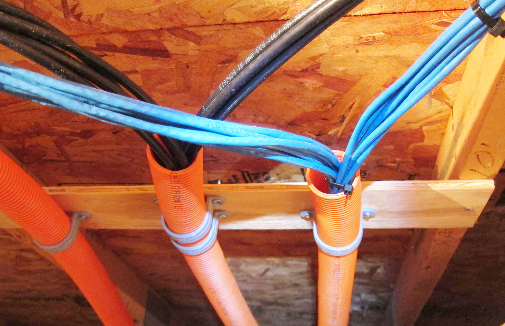
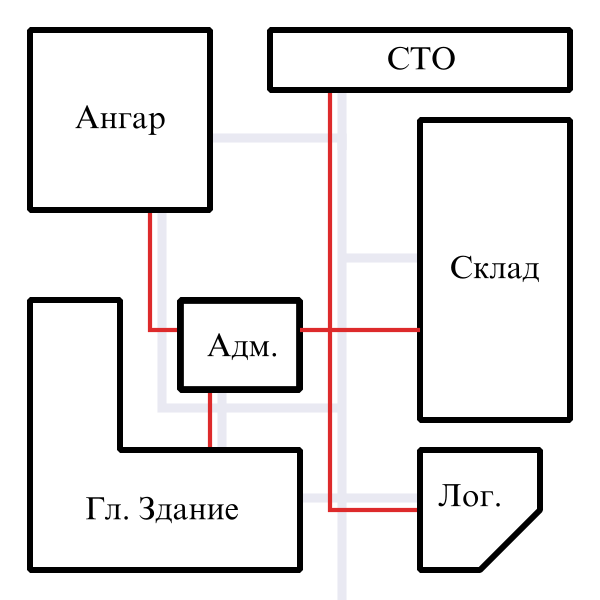
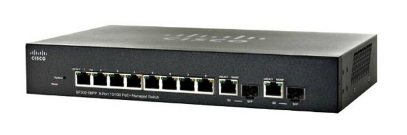
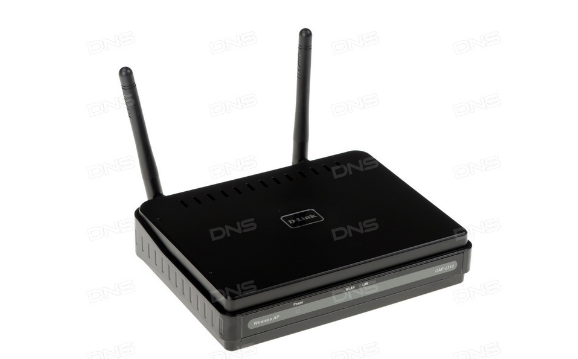

Введение
========

С течением времени и развитием человечества, изменениям подвергались все
плоды деятельности людей, в том числе в социальных, предпринимательских,
"корпоративных" ее проявлениях.

Так, например, купцы, раньше по несколько месяцев ожидавшие весточку
из-за моря от своего "торгового партнера" и представить не могли, что
сегодня информация доходит до адресатов за считанные секунды.

С развитием предпринимательской деятельности, с превращением маленьких
компаний в огромные корпорации, чьи филиалы могут функционировать в
разных частях света, усовершенствовались и информационные технологии,
используемые для нужд организаций.

Будь то маленькая компания, которая имеет в распоряжении всего одно
здание, или огромная, с сотнями филиалов, каждая из них должна иметь
тщательно отлаженный механизм - Информационную систему, позволяющую
централизованно управлять хозяйственной деятельностью предприятия. Такая
система, имеющая строгую иерархическую структуру, и особенно важная для
организаций, чьи здания расположены удаленно друг от друга, называется
Корпоративной Информационной системой, технически сложной и имеющей в
своем составе множество элементов: от компьютеров разных видов и
сетевого оборудования, до структурированной системы кабелей.

Очень важно, чтобы Корпоративная Информационная система (КИС) отвечала
требованиям, диктуемым как, отчасти, общепринятыми, давно установленными
аксиомами, так и современным тенденциями: быть надежной и устойчивой,
обеспечивая стабильное информационное обеспечение организации, а также
предусматривать возможность наращивания и масштабирования, учитывая
непрерывное развитие Информационных Технологий, и возможное изменение
потребностей предприятия. Еще одним, немаловажным для КИС критерием
является соответствие потребностям организации в автоматизированной
обработке информации и ее финансовым возможностям: любая компания ищет
наиболее продуктивное, но экономичное решение.

Я выбрал тему о построении КИС для курсовой работы потому, что в наши
дни Корпоративные ИС распространены практически повсеместно и без них,
можно сказать, уже нельзя представить современный бизнес, современную
организацию. Иметь представление о том, из чего состоит КИС, знать
принципы ее работы и построения – все эти знания несомненно важны как
для IT-специалиста, так и для руководителей организации: они могут
существенно увеличить продуктивность бизнеса: зная о том, насколько
эффективно можно использовать информационное обеспечение предприятия в
масштабах корпорации, можно максимально эффективно распоряжаться
данными, например, самое банальное, увеличить скорость их передачи из
одного филиала организации в другой, облегчить как руководящему, так и
обычному, штатному персоналу, работу с данными и улучшить
коммуникационные показатели предприятия.

Цель данной курсовой работы – узнать об устройстве корпоративной
информационной системы, о способах ее построения, узнать, насколько
эффективна может быть такая система как с технической, так и с
экономической точки зрения.

Обозначим задачи данной работы:

1.  Построить КИС, отвечающую всем требованиям, предъявляемым к ней;

2.  Использовать наиболее эффективные проектные решения, отвечающие
    современным нуждам предприятий;

3.  Выбрать самый выгодный с экономической точки зрения путь реализации
    КИС;

4.  Рассмотреть пути обеспечения стабильной работы КИС, а также защиты
    данных от утери или несанкционированного доступа.

Глава 1. Теоритическая часть. Корпоративные ИС
==============================================

Цель и назначение Корпоративной ИС
----------------------------------

Внедрение КИС можно назвать одним из главных этапов управления
предприятием: отчасти потому, что необходимость внедрения КИС говорит о
расширении организации и росте ее потребностей: когда компания только
начинает развиваться, вполне возможно, что сотрудники могут с
определенной продуктивностью использовать стандартное офисное
программное обеспечение.

Однако, со временем, увеличение объема информации, которую необходимо
обрабатывать, собирать, передавать ставит перед компанией задачу
создания современной Корпоративной Информационной Системы.

Основные цели применения КИС на предприятии заключаются:

1.  в оперативном доведении руководящим сотрудникам всех подразделений
    предприятия полной и точной информации в нужном объеме и удобной
    форме;

2.  В создании общего информационного пространства для всей иерархии
    управления;

3.  В упрощении регистрации и обработки данных;

4.  В избежании многократной регистрации идентичной информации;

5.  В регистрации и обработке информации в режиме реального времени;

6.  В обобщении данных в соответствии со спецификой структуры
    распределения предприятия.

Также, косвенно, Корпоративная ИС увеличивает прибыль предприятия, так
как увеличивает качество и скорость обработки данных и обеспечивает
своевременное доведение качественной информации управленческому
персоналу для принятия решений, что, в свою очередь, увеличивает
продуктивность функционирования организации.

Результатом внедрения корпоративной системы для предприятия, в виду
автоматизации обработки информации, станет:

-   Повышение внутренней управляемости компании, рост ее надежности и
    устойчивости к внешнему воздействию;

-   Увеличенная конкурентоспособность и эффективность предприятия,
    следовательно, увеличенный показатель прибыльности;

-   Рост объемов продаж;

-   Снижение себестоимости затрачиваемых ресурсов;

-   Уменьшение складских запасов;

-   Сокращение сроков выполнения заказов;

-   Улучшение взаимодействия с поставщиками.

Классификация КИС
-----------------

Для того, чтобы выбрать подходящую КИС, руководитель организации должен
четко осознавать, в каких именно целях такая система будет
использоваться. В зависимости от возлагаемых на нее задач, можно
выделить 6 разновидностей корпоративной ИС.

Система ERP (Enterprise Resource Planning System) выстраивает в единую
цепочку корпоративные ресурсы, которые связаны с производством,
продажами, учетом заказов. Такой проект довольно востребован в
современном бизнесе: последние десять лет он во всем мире является
«золотым стандартом» автоматизации для абсолютного большинства
предприятий. Достаточно сказать, что разработкой подобных проектов
заняты свыше 100 компаний, причем большинство из них ориентировано на
запросы среднего бизнеса, создавая для него «облегченные» версии системы
по привлекательной цене;

Система CRM (Customer Relationship Management System) – КИС, нацеленная
на эффективное управление клиентской базой на различных этапах
взаимодействия – от проведения сделок до сбора и анализа информации о
покупателях. Рынок CRM-систем в России оценивается экспертами в \$50-70
млн и считается очень перспективным, особенно в финансовых, страховых и
телекоммуникационных компаниях. Например, в Банке России функционирует
система автоматизации документооборота, которая 10 лет назад
использовалась ограниченно, для сопровождения бумажного
документооборота, а ныне она получила распространение не только как
система электронного документооборота в системе учреждений Банка, но и в
отраслевом управлении документами. Эффективная работа CRM с клиентской
базой по закону Ципфа-Парето, когда 80% результата обусловлено 20%
усилий. И действительно, 20% усилий бизнес-аналитиков благодаря
информационной системе дают 80% результата. Им уже нет необходимости
первичной обработки данных, за них это сделала система, обеспечив их
информацией для анализа и выдвижения финансовых предложений;

Система MES (Manufacturing Execution System) разработана для
производственников, которые, воспользовавшись ее возможностями, смогут
не только отследить этапы производственного цикла в режиме реального
времени, но и существенно оптимизировать его, внося необходимые
коррективы в процесс прямо по ходу дела. Причем, что крайне полезно,
система отразит и отдачу основных фондов, и оборот денежных средств, и
беспристрастно рассчитает себестоимость, прибыль и эффективность не
только в корпорации в целом, но и на отдельном участке цеха,
производственной линии. Что может упустить человек, не упустит система,
особенно если это касается детальной разработки этапов проекта,
прохождения контрольных точек, учета необходимых ресурсов;

Система WMS (Warehouse Management System) имеет узкую специализацию и
направлена на наведение идеального порядка на складе, она управляет
складскими процессами путем их комплексной автоматизации;

Система EAM (Enterprise Asset Management) борется с простоями
оборудования, вынуждает снижать затраты на ремонтные и профилактические
работы и ставит под сомнение излишне щедрое финансирование, на которое
претендуют снабженцы. Словом, это довольно эффективный инструмент для
менеджеров, в ведении которых находятся компании фондоемких отраслей –
от горнодобывающей промышленности до жилищно-коммунального хозяйства.
Остается только добавить, что все чаще EAM (уже в качестве модуля)
включают в крупные ERP-системы, отдавая в их ведение управление
основными фондами;

Система HRM (Human Resource Management) ведает учетом персонала, его
поиском, оценкой, обучением, мотивацией.

Требования к КИС
----------------

Корпоративная ИС, для того, чтобы в ней была заинтересована организация,
должна соответствовать ряду определенных требований, гарантирующих, в
первую очередь, актуальность той или иной Корпоративной системы для
организаций-клиентов.

Среди требований к КИС можно выделить несколько основных.

Гибкость.

Гибкость - ни что иное, как способность информационной системы
адаптироваться и развиваться в соответствии с современными тенденциями и
возможность приспособления информационной системы к новым условиям,
новым нуждам организации. Выполнение этих условий осуществимо только
тогда, когда при разработке КИС использовались общепринятые средства и
способы документирования. Таким образом, спустя определенное время
возможность разобраться в строении системы и внести в нее нужные
коррективы сохранится, даже если вся команда разработчиков или ее часть
по каким-либо причинам не смогут продолжить работу.

Любая ИС рано или поздно морально устареет: тогда, встает вопрос ее
модернизации или о более кардинальном решении - ее полной замене, что
является далеко не самым удобным решением, поэтому гибкость КИС
обеспечит долгое ее функционирование, с учетом своевременной
модернизации, а таким образом снизит расходы предприятия на внедрение
новой КИС, точнее, вовсе избавит его от этих расходов.

Надежность.

Надежность информационной системы обеспечивает ее функционирование без
искажения информации, потери данных в виду различных причин технического
характера, будь то сетевые сбои или неисправность ПО. Соответствие ИС
этому требованию обеспечивается созданием резервных копий хранимых
данных, выполнением операций протоколирования, поддержанием качества
каналов связи' и физических носителей информации, использованием
современного программного и аппаратного обеспечения. К этому требованию
важно, также, отнести защиту от случайных потерь данных из-за
недостаточного уровня квалификации персонала.

Эффективность.

Систему можно назвать эффективной, если она, учитывая выделенные ей
ресурсы, позволяет решать возложенные на нее задачи в минимальные сроки.

Эффективность системы обеспечивается оптимизацией данных и методами их
обработки, применением оригинальных разработок, идей, методов
проектирования.

Безопасность

Под безопасностью, в первую очередь, подразумевается свойство системы, в
силу которого посторонние лица не имеют доступа к информационным
ресурсам предприятия, кроме тех, которые для них предназначены.
Соответствие данному требованию достигается с помощью различных методов
контроля и разграничения доступа к информационным ресурсам.

Защита информации от постороннего доступа обеспечивается управлением
доступом к ресурсам системы, использованием современных программных
средств защиты информации.

Требования к программному обеспечению КИС
-----------------------------------------

Программное обеспечение (ПО) – совокупность программ, которая
предназначена для работы компьютера от момента его включения до момента
выключения, позволяющая создавать среду для автоматизированной обработки
данных. Сетевое программное обеспечение – это программное обеспечение,
позволяющее организовать работу пользователя в сети.

Системы ПО на российском рынке бывают трех уровней.

На первом уровне располагаются простые системы для малого и сверхмалого
бизнеса, по цене от 100 до 10000 долларов. В этом сегменте доминируют
российские продукты. Их очень много, в основном это программы,
предназначенные для простых бухгалтерских функций. Они имеют ограничения
по количеству операций, по возможности наращивания дополнительных
мощностей, по защищенности данных и другим параметрам, но зато просты в
использовании и дешевы.(примеры: 1С бухгалтерия, система BEST,
супер-менеджер, турбо-бухгалтер, SUPER МАГ-200-небольшие рабочие группы,
для малых и средних предприятий – парус, BEST-pro, флагман)

Второй уровень - интегрированные системы, поскольку дают возможность
вести одновременно и управленческий и финансовый учет. Они не так похожи
друг на друга, как системы первого уровня. Например, в одной из них
может присутствовать модуль, разработанный специально для
металлургического завода, в другой - нет, но зато могут присутствовать
другие важные частности. И поэтому здесь уже не столь важен сам продукт,
как то, как он внедряется, и, следовательно, на предприятии должны
присутствовать квалифицированные специалисты, хорошо знающие как и
бизнес компании, так и специфику ПО. В этом сегменте больше продуктов
западных, нежели отечественных. Выбирая западный продукт, первым делом
стоит обращать внимание на то, как он привязан к российским реалиям: к
законодательству, инфляции и т.п.(форс, r-stule, Microsoft-navision)

Системы третьего уровня - это масштабные системы управления предприятием
в целом по цене от 150 тыс. долларов и выше (все зависит от числа
пользователей, от удаленности доступа, уровня базы данных и т.д.). в
мире таких систем всего около десятка, российских систем таких нет. Эти
системы функционально различны, водной хорошо развито производство, в
другой финансы. Для осуществления проекта внедрения нужна целая команда
из финансовых, управленческих и технических экспертоа имеющих
достаточный опыт, такие системы строятся на основе IRP модели,
обеспечивают планирование и управление всеми условиями предприятий: R/3
Baan, oracle application, MFG/PRO. R/3 – реализует более 1000 бизнес
процессов и для большинства предприятий слишком сложна.

При проектировании КИС должны быть определены требования к ПО:
системному, промежуточного слоя, прикладному и инструментарию разработки
с учетом наличия серверной (количество рабочих мест, документооборот,
объем обработки информации) и клиентской частей системы.

Требования к системному (например, операционным системам) ПО:

1.  Поддержка многопроцессорной обработки (мультипроцессироание);

2.  Масштабируемость – способность работать при увеличении
    количественных характеристик сети;

3.  Способность работать в гетерогенной (неоднородной) среде интерсети в
    режиме plug-and-play.

4.  Требования к промежуточному (обеспечивающему взаимодействие между
    различными приложениями, системами, компонентами) ПО:

5.  Соответствие тем условиям, в которых осуществляется взаимодействие,
    в ряде случаев целесообразно комбинирование различных типов ППО для
    достижения необходимой функциональности.

Требования к прикладному (для осуществления конкретной деятельности) ПО:

1.  Полнота функциональных возможностей систем;

2.  Уровень реализации функциональных модулей систем;

3.  Стоимость и продолжительность внедрения;

4.  Влияние системы на бизнес и бизнес-процессы предприятия.

Соответствие ПО этим требованиям составляет большую часть гарантии того,
что КИС будет функционировать наиболее эффективно, так как рядовые
сотрудники, в первую очередь, пользуются ПО для работы на предприятии, в
том числе и с данными.

Требования к техническому обеспечению корпоративных информационных систем
-------------------------------------------------------------------------

Техническое обеспечение - это совокупность технических средств, которые
используются на предприятии. Техническое обеспечение выбирают,
руководствуясь объемом и сложностью решения поставленных задач, а также
уровнем развития Информационных технологий в сфере деятельности,
осуществляемой предприятием. К техническому обеспечению относится
различная организационная техника, такая как компьютеры, устройства
ввода-вывода, мультимедиа-устройства, сетевое оборудование, устройства
хранения информации, и так далее.

Все техническое обеспечение предприятия должно отвечать определенным
требованиям:

-   Техническая совместимость – единство процедур управления на уровне
    центральных (таких устройств, как процессор и оперативная память) и
    внешних устройств;

-   Информационная совместимость – единый формат представления данных;

-   Программная совместимость – единый набор команд, система адресации и
    логическое строение ЭВМ;

-   Масштабируемость – возможность наращивания мощности и
    производительности;

-   Сертификация технических средств и технологий;

-   Экономичность эксплуатации техники;

-   Выбор комплекса технических средств при необходимости связи с другой
    информационной системой;

-   Описание работы технических средств (также в аварийном режиме);

-   Обоснование применения и технические требования к оборудованию;

-   Обоснование методов защиты технических средств от механических,
    тепловых, электромагнитных и иных воздействий;

-   Требования надежности;

-   Расчет площадей и технические решения по оснащению рабочих мест;

-   Решения по контролю данных при вводе в систему и в процессе их
    хранения;

-   Решения по выбору средств и телеобработки и передачи данных, в том
    числе - решения по выбору каналов связи;

-   Требования к арендуемым каналам связи;

Обеспечение информационной безопасности в КИС.

Все главные особенности корпоративной сети обуславливают повышенный риск
несанкционированного доступа к информации в сетях этого типа.
Обеспечение безопасности в корпоративной сети – задача сложная и
несомненно важная: очевидно, огромные материальные потери, к которым
может привести доступность некоторых данных для заинтересованных в этом
людей, переводит безопасность из ряда чисто технических вопросов в
разряд приоритетных.

Управление безопасностью призвано обеспечивать защиту корпоративной сети
от несанкционированного доступа к критически важным данным или ресурсам
организации. В правильно спроектированной сети система безопасности
должна быть тесно интегрирована сетевыми сервисами и ресурсами.
Большинство производителей встраивают в свои программные и аппаратные
продукты большое количество интегрированных механизмов безопасности.
Технологии обеспечения безопасности могут быть разделены на две
категории: средства обеспечения защиты от несанкционированного доступа
изнутри компании (например, сотрудники или внутренние пользователи);
средства обеспечения защиты от несанкционированного доступа снаружи
(например, из Internet).

Аутентификация – наиболее часто используемый способ защиты информации.
Она требует для обеспечения безопасности применения паролей
пользователей и системы, прав доступа к ресурсам, сервисам и данным
сети. В соответствии с возрастающими требованиями к обеспечению
безопасности сетей, разработчики создают новые механизмы аутентификации.
Например, используется система аутентификации на базе пластиковых карт.
Когда пользователь желает получить доступ к сети, он вводит персональный
код на специальном устройстве Active Cards. Active Cards однократно
генерирует пароль, с которым пользователь регистрируется в сети. Такой
метод предотвращает любые попытки кражи пароля злоумышленником для
доступа в сеть в момент отсутствия пользователя.

Программное обеспечение защиты от вирусов является важным для
обеспечения целостности и безопасности организаций. Это программное
обеспечение выполняет сканирование всех данных, поступающих в сеть или
хранящихся на рабочих станциях и серверах. При обнаружении вирусов,
антивирусное ПО выдает предупреждающее сообщение, и принимаются попытки
уничтожения вируса. Своевременное обновление антивирусного программного
обеспечения позволяет обнаружить и устранить любые вирусы.

Защита сети от проникновения внешних злоумышленников выполняется путем
установки межсетевых экранов (маршрутизаторы выполняют фильтрацию
входящего и исходящего трафика в соответствии с правилами, определенными
администратором сети)

Современные средства защиты от несанкционированного доступа обширны и
могу обеспечить самый высокий уровень безопасности. Использование
технологий VPN - виртуальных частных сетей - позволяет безопасно
передавать конфиденциальные данные между филиалами компании по
общедоступным сетям, таким как Интернет. Для обеспечения безопасности
данные могут быть зашифрованы. Для создания безопасных туннелей связи
используются межсетевые экраны (например, Cisco Secure PIX Firewall) и
маршрутизаторы со специальной версией программного обеспечения (Cisco
IOS). Межсетевой экран (Cisco Secure Private Internet Exchange (PIX))
устанавливается в месте подключения корпоративной сети к внешним сетям,
таким как Интернет, при этом организуется защита внутренней сети на
самом высоком уровне. Существуют системы обнаружения
несанкционированного доступа (например, Cisco Secure Intrusion Detection
System (IDS)), которые предназначены для обнаружения
несанкционированного доступа и принятия действий для своевременного
блокирования такого доступа.

Интрасети (интранет, intranet) – это внутренняя, частная сеть
организации, в которой используются те же протоколы и стандарты, что и в
Internet. На сервере создается конечный продукт – информация в форме,
предназначенной для пользователя. Информация передается клиентам в виде,
пригодном для восприятия человека. Информационная система
сконцентрирована на сервере, а на клиенте кроме программ – навигаторов
ничего нет. Для обмена информацией между клиентом и сервером
используются протоколы открытого стандарта. Доступ к информации
осуществляется через одну и ту же программу, не требующую локальных
данных. Устройство на рабочем месте настраивается из центра и нет
необходимости его конфигурировать. Основное свойство интрасетей - это
централизованное управление не только серверной частью, но и рабочими
местами. Технология тиражирования информации позволяет кардинально
решить вопрос о надежности информации за счет дублирования и раздельного
хранения важной информации.

Открытые стандарты в Intranet: SNMP - управление сетевыми устройствами.
SMTP, ITAP, MIME – протоколы почты, протоколы телеконференции NNTP,
информационный сервис – HTTP, HTML. Справочная служба LDAP, JAVA, а
также сервисы, делящиеся на пользовательские (создание и публикация
документов, координация работ и взаимодействие пользовательской
информационной системы, такой как электронная почта, и другие средства
коллективной работы, навигация, а именно быстрый поиск и доступ к
информации, доступ к приложениям) и сетевые (справочники управления
информацией о людях и ресурсах, прозрачное распространение данных по
сети, безопасность, управление).

Экстрасеть (extranet) - две или более интрасети, соединенных таким
образом, чтобы предоставить возможности совместного использования
информации, размещенной в любой из этих сетей. Основная функция
экстрасети - это предоставление доступа к форматизированный информации и
корпоративным службам, удаленным подразделениям компании, франчайзинг
дилерской сети оптовыми покупателями.

С точки зрения пользователя, экстранет – это система, которая
представляет собой невидимый в поисковых машинах корпоративный сайт,
доступ к которому имеют только авторизированные пользователи или
пользователи с определенным IP адресом. Доступ к системе предоставляется
администратором по заявке пользователя. При создании такой системы,
приоритетными являются задачи безопасности и разграничения прав доступа
к информации и сервисам. Уровень защиты экстранет-систем обычно выше,
чем защита обыкновенного корпоративного сайта. Компания имеет
возможность размещать в такой системе закрытые корпоративные материалы и
предоставлять пользователям доступ к сервисным функциям напрямую
связанными с деятельностью компании.

Виртуальные частные сети (Virtual Private Networks – VPNs) - частный
глобальный канал связи, соединяющий между собой две или более
географически удаленных друг от друга частей организаций и использующей
в качестве среды передачи данных публично доступную магистраль
глобальной сети.

VPN может не обеспечивать такого же уровня производительности, как
выделенные каналы связи. Однако, данная технология обладает
преимуществами, такими как: стоимость реализации и прозрачность
взаимодействия корпоративных сетей и интранет.

Применяя эту технологию в интранет, можно использовать один и тот же
физический канал связи для обмена конфиденциальной информацией по сети
VPN между удаленными офисами и главной организацией для предоставления
общедоступной информации потенциальным заказчикам.

В Internet. технология VPN базируется на технологии туннелирования,
которая позволяет обмениваться данными путем встраивания (инкапсуляции)
пакета данных в пакет TCP/IP для его передачи через internet.

Инкапсуляция данных обеспечивает возможность передачи пакета данных
сформированного с использованием любого протокола по туннелю TCP/IP и
гарантирует необходимый уровень безопасности при обмене конфиденциальной
информацией.

Механизм туннелирования подразумевает применение специального протокола.
С использованием такого протокола два удаленных офиса организуют между
безопасный туннель (сеанс связи). После формирования, все данные,
предназначенные для передачи шифруются и инкапсулируются в пакет TCP/IP,
расшифровываются и передаются конкретному адресату.

Наиболее популярные протоколы туннелирования - IP Sec и PPTP. Протокол
IP Sec является самым новым. Он формируется на третьем (сетевом) уровне
модели OSI и обеспечивает установление безопасного туннеля, используя
технологию цифровых сертификатов для шифрования данных и аутентификацию
пакетов.

По аналогии с протоколом IP Sec, протокол PPTP инкапсулирует
передаваемые данные и передает через туннель адресату. Протокол PPTP
использует протокол GRE в качестве протокола инкапсуляции. Протокол PPTP
состоит из двух компонентов: протокол контроля соединения (TCP) и IP
туннеля, применяемого для транспортировки инкапсулируемых пакетов
данных.

Рекомендации эффективному использованию материальных ресурсов предприятия при внедрении КИС
-------------------------------------------------------------------------------------------

Очевидно, что в собственных разработках, пусть даже созданных давно,
разобраться проще, нежели в чужих решениях, не всегда на первый взгляд
логичных и понятных. Фазу сопровождения КИС рекомендуется доверять
лицам, которые занимались ее проектированием.

Разработчики информационных систем, как правило, не являются
специалистами в сфере деятельности, для которой разрабатывается система.
Участие в модернизации или создании новой системы той же группы
проектировщиков существенно сократит сроки модернизации. Однако, вместе
с тем возникает риск применения устаревших решений при модернизации
системы, поэтому, стоит отнестись к подбору разработчиков информационных
систем с должным вниманием, дабы избежать нерациональной траты
материальных ресурсов организации.

КИС обязательно должна пройти этапы тестирования, не только
разработчиками, но и будущими пользователями, ибо работать с системой
будут именно сотрудники организации. Этап тестирования позволит выявить
все недочеты и ошибки в представляемой системе и помочь разработчикам
доработать ее до должного уровня.

Глава 2. Практическая часть. Проектирование корпоративной компьютерной сети на предприятии
==========================================================================================

Задача
------

Компания ЗАО «Дороги Рус» занимается дорожной разметкой по всей територии Российской Федерации. Компания не вкладывалась в развитие новых технологий в связи с чем начала уступать конкурентам. Администрация решила купить аналог системы конкурентов, но для работы необходимо создать локальную вычислительную сеть. Информационная система разворачивается полностью автоматически, необходимо только построить физическую сеть из участвующих электронно-вычислительных машин.

В сеть необходимо включить здания:

-   главное здание

-   основной офис логистики

-   здание администрации

-   станцию технического обслуживания

-   ангар с транспортом, который учавствует в покраске дорожной разметки

-   склад с ресурсами

Здания расположенны на разных растояниях и имеют совершенно разную планировку. Их схема изображенна на карте (см. рисунок 1). Красным отмечены дорожное сообщение между зданиями. На изображении маштаб равен 1 к 1000.

Рисунок 1. Карта територии

Из-за отсутствия других комуникаций над землей по технике безопасности. По технике безопасности утвержденной на предприятии запрещено использовать навесные электро-провода в близи с станциями технического обслуживания транспортной техники исходя из специального экологического топлива, которое легковоспламеняемо. В связи с этим все комуникации усуществляются под землей.

Когда вы находитесь на этапах планирования установки, убедитесь, что вы учитываете общее расстояние от кабеля, а не только длину кабеля, который он проедет под землей. Как только кабель достигнет точки соединения вне структуры, часто необходимо, чтобы кабель мог перемещаться на 10-15 метров внутри структуры как минимум, чтобы достичь точки, в которой он будет заканчиваться. Это будет означать, что если вы используете кабель на расстоянии 150 метров под землей и все еще должны устанавливать соединения на обоих концах, вы, вероятно, будете иметь пониженную пропускную способность из-за высокой длины. Убедитесь, что вы не превысите предел 150 метров. В другом случае стоит воспользоваться альтернативными технологиями.

Вам нужно будет подумать о том, как кабель будет защищен от элементов по длине подземного хода, если вы решите тянуть его под земилей. Оболочка из ПВХ и высококачественный кабель CAT 5 более чем способен выдерживать непосредственное захоронение в земле, стоит рассмотреть возможность использования какого-либо типа защитного трубопровода. Многие установщики выбрали использование труб из ПВХ для этого приложения из-за его вязкости и низкой стоимости. Другие типы кабелепроводов можно легко приобрести, включая металлические аналоги.

Рисунок 2. Кабель в защитной оболочке

На рисунке 2 изображен пример использования гофрированных труб для подземной прокладки кабеля или прокладки в местах с высокой влажностью. Эта гофрированная труба предназначенна специально для соединения между зданиями без дополнительной защиты. Может быть протянута без затруднений и прямо по земле, но транспорт подвергнет опасности провода. Такой кабель рекомендованно закапывать на метр в глубь, но по скольку вся територия зацементированна это невозможно. Выход из ситуации &mdash; водосток, который расположен вдоль дорог. Он расположен рядом с пешеходным тротуаром и дорогой для транспорта. Фактически можно соединить здания между собой таким образом.

Измерения водосточных каналов помогли составить схему прокладки кабеля (смотреть рисунок 3). Общая длина кабеля равна 320 метров суммарно. Также добавим количество метров до коммутатора: 10. Самый протяженный участок получается 130 метров, что соответствует требованиям. Главный корпус администрации будет основным пунктом для маршрутизации. От этого здания будет оптимально протянуть кабель ко всем остальным зданиям. Смотрите таблицу 1, в ней описан метраж всех отрезков сообщения.

Рисунок 3. Карта кабеля

Таблица 1

Метраж отрезков сообщения

 | Здание         | Длина  |
 |----------------|--------|
 | офис логистики | 110 м. |
 | СТО            | 100 м. |
 | ангар          | 50 м.  |
 | склад          | 40 м.  |
 | главное здание | 20 м.  |

Материалы и ресурсы
-------------------

Гофрированная ПВХ труба используется для устройства кабельных сетей, защиты изолированных проводов от влаги, мелких повреждений, пыли, брызг воды. Изделие может применяться в помещении или на улице. Необходимая нам длина равна 320 метров. С запасом равна 420 метров, учитывая внутри помещений. Цена за 100 метров равна 484 рубля. Цена 420 метров будет равна 2032 рублей и 80 копеек.

Преимущества:

+ прочность, гибкость;

+ стойкость к влаге и механическим повреждениям;

+ наличие зонда для протягивания одного или нескольких кабелей;

+ долговечность, легкость монтажа.

Рисунок 4. Гофрированная труба

Такой же длины необходима витая пара. Это кабель для передачи данных. Выберем высшую категорию cat-5e, чтобы иметь уверенность в соответствии современным требованиям и требованиям будущего. Витая пара SkyNet CSL-UTP-2-CU используется для прокладки внутри помещений. Модель соответствует требованиям категории 5e. Особенности стандарта передачи данных с помощью витой пары предполагают длину сегмента, равную 100 м. Кабель поставляется в бухте стандартной длины: 305 м. Изоляция эффективно защищает кабель от внешних механических воздействий. Выбранный кабель &mdash; экранированная витая пара. Цена за 100 метров 999 рублей. 420 метров обойдутся в сумму: 4198 рублей и 60 копеек.

Рисунок 5. Кабель витая пара

Также необходим комутатор в здание администрации. Коммутаторы Cisco серии 300 SF302-08PP-K9-EU могут просто и надежно соединить сотрудников, работающих в небольших офисах, между собой или со всеми серверами, принтерами и другими устройствами, которые они используют. Он необходим в центральном офисе, для связи между всеми зданиями.

Входящее в поставку программное обеспечение для управления устройствами предоставляет интуитивно понятный веб-интерфейс для упрощения настройки, обеспечения безопасности и установки приоритетов трафика для поддержания качества обслуживания (QoS), позволяя даже пользователям без ИТ-опыта настроить коммутатор за считанные минуты.

Цена комплекта 15799 рублей.

Рисунок 5. Коммутатор Cisco

Также нужна в каждое здание точка доступа D-Link DAP-2310, для обеспечения сети на предприятии. Точка доступа D-Link DAP-2310, поддерживающая стандарт беспроводной сети 802.11n, представляет собой оптимальный вариант для создания или увеличения работоспособности уже существующей локальной сети. Данное устройство используется, в основном, в общественных местах. Точка доступа позволяет осуществить построение управляемой и, самое главное – защищенной локальной сети. Внешний интерфейс D-Link DAP-2310 представлен одним гигабитным портом LAN. Безопасность работы пользователя в сети Интернет обеспечивается за счет использованию инновационных технологий шифрования данных WEP/WPA/WPA2.

Цена такого устройства: 1399 рублей. Таких устройств нужно 6, следовательно сумма будет равна 8394 рублей.

Рисунок 6. Точка доступа D-Link

В итоге общая сумма &mdash; 27724 рублей и 40 копеек.
