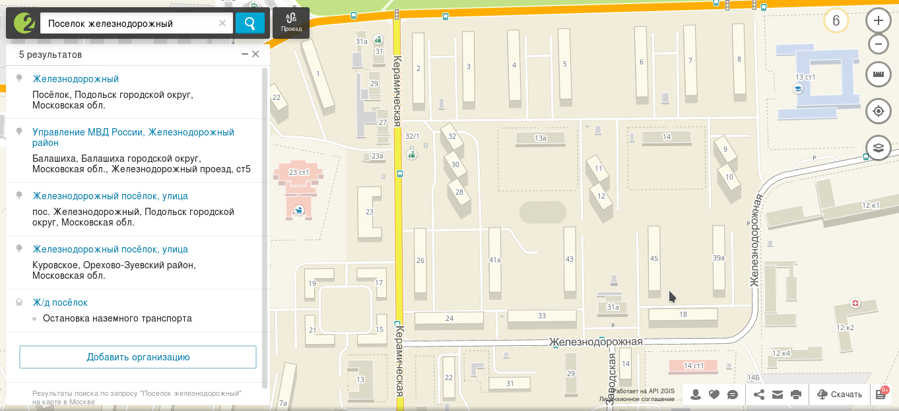
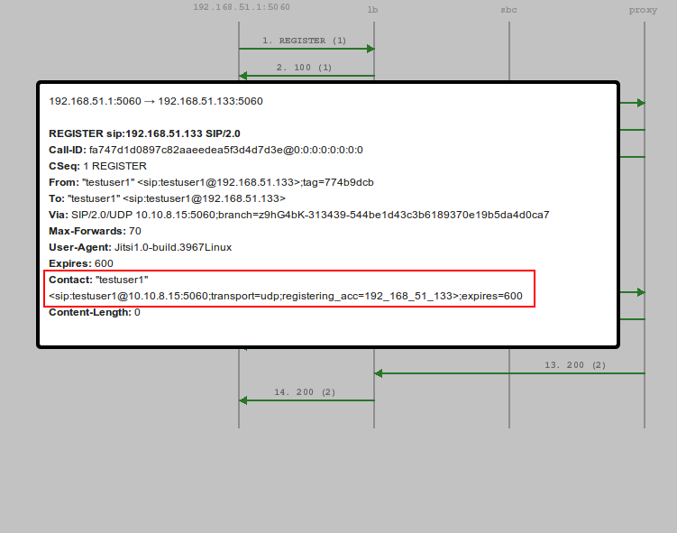
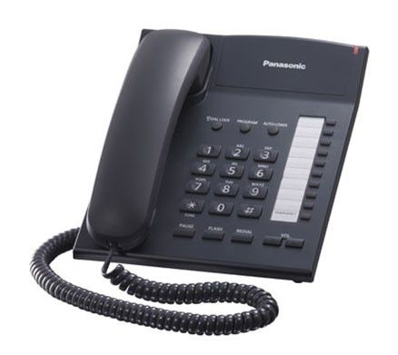
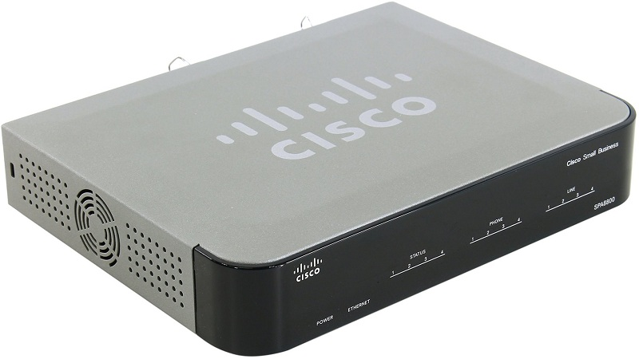
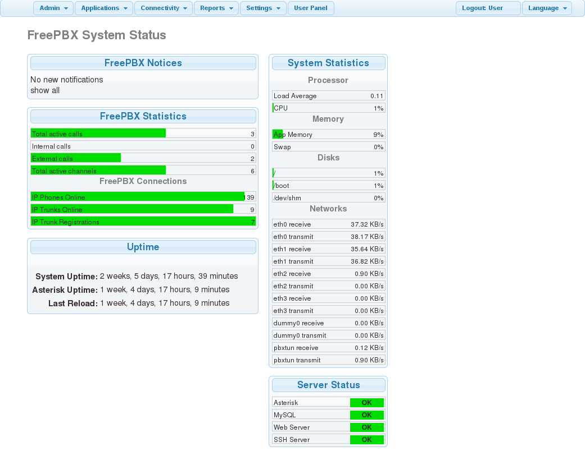
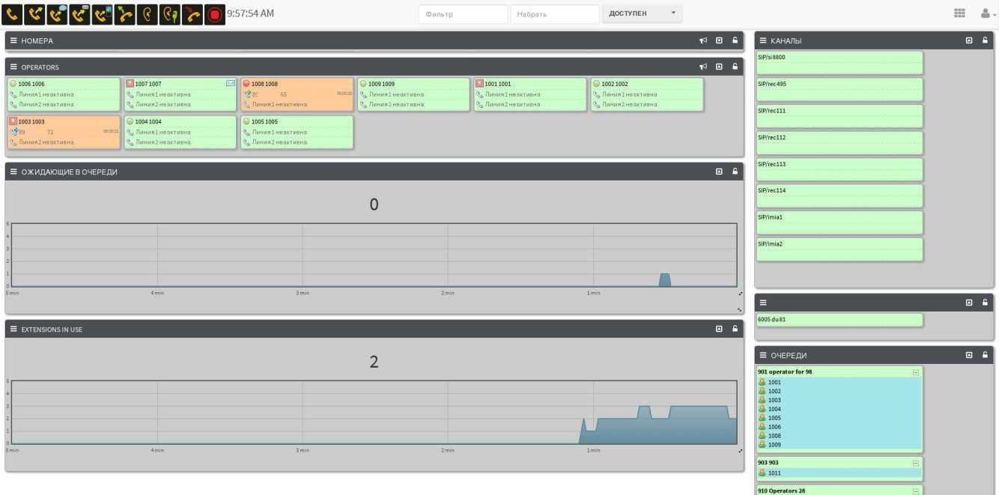

Введение
========

В 90-е годы ХХ века эра классической телефонной связи, основывающейся на
коммутации каналов стремительно пошла на убыль, уступая место более
совершенной технологии передачи речи, а именно – пакетной телефонии.
Несомненно, такой рывок вперед в сфере телефонной связи обусловлен
появлением Internet, когда все сети передачи данных совершили
революционные изменения в индустрии связи, и в конечном итоге подарили
все преимущества своих технологий в отрасли телефонии.\
IP- телефония, которую кратко можно описать, как телефонную связь с
использованием Internet-технологии, является разновидностью пакетной
телефонии, причем самой востребованной и популярной. Под технологией
IP-телефонии подразумевается набор коммуникационных протоколов,
специального оборудования, поддерживающего технологию VoIP (Voice over
IP), программного обеспечения, технологий и методов, обеспечивающих
традиционные для телефонной связи функции: набор номера, дозвон и
двустороннее голосовое общение, а также видеообщение по сети Интернет
или любым другим IP-сетям. Популярность данной технологии обусловлена
широким распространением протокола TCP/IP, который, в первую очередь,
ассоциируется с Интернетом, однако находит все большее проявление и в
локальных сетях. Широкое распространение этого протокола дает
возможность использовать при передаче голоса только один протокол на
всей линии связи, что значительно упрощает управление сетью. В связи с
этим, например, в рамках одной организации можно построить единую
информационную систему, в которой голос и данные будут передаваться по
одной и той же кабельной инфраструктуре. Одним из основных преимуществ
IP-телефонии является существенное снижение затрат на связь; во многих
случаях VoIP- связь – вовсе бесплатна. Этот факт может помочь абонентам
сэкономить на международных и междугородних звонках, так как
относительно цен на услуги традиционных телефонных операторов стоимость
IP-сервисов существенно меньше.

В данной курсовой работе будет рассмотрена технология проектирования IP-
телефонии в многоквартирном доме. Несмотря на масштабы популярности
связи с помощью мобильных телефонов, стационарный телефон и по сей день,
как правило, считается неотъемлемым атрибутом городской квартиры. Задача
по осуществлению телефонизации касается, в первую очередь, недавно
возведенных домов. Тем не менее, в виду наметившейся тенденции к
массовому переходу на цифровую связь данный вопрос актуален и для тех
многоквартирных домов, которые уже давно находятся в эксплуатации и в
качестве связи до сих пор используют аналоговые телефонные линии. Именно
актуальностью и близостью данного вопроса к каждому человеку обусловлен
мой выбор темы для курсовой работы.

Цель данной работы – спроектировать телефонную IP- сеть в
многоквартирном доме, учитывая специфику запросов пользователей и
потребность в непрерывном функционировании данной сети.

Задачи данной работы:

-   Рассмотрение конкретного назначения проектируемой сети;

-   Рассмотрение принципа работы телефонной IP- сети;

-   Выбор наиболее подходящей технологии для построения сети.

Глава 1. Теоретическая часть. IP- телефония
===========================================

Принцип работы IP-телефонии
---------------------------

В данном пункте более подробно рассмотрим принцип работы данной
разновидности пакетной телефонии.

IP-телефония работает следующим образом: голос одного абонента в
компьютере или в IP-телефоне преобразуется в цифровой сигнал и
передается на компьютер IP-телефон собеседника. После он преобразуется в
аналоговый сигнал и воспроизводится динамиком компьютера или телефона.

Если звонок поступает на обычный телефон, сигнал проходит через IP-шлюз,
преобразующий цифровой сигнал VoIP в аналоговый. Процесс происходит
аналогично и при звонках через IP-телефонию на средства мобильной связи.

При передаче через IP-сеть, голос обычно «сжимается» специальной
программой - кодеком. Это обеспечивает увеличение скорости передачи
голосового сообщения, и, исходя из этого, повышает качество связи.
Помимо этого, в целях обеспечения безопасности сигнал может, опять же,
при помощи кодека, подвергаться шифрованию. Из этого следует, что связь
между двумя VoIP терминалами возможна только если они имеют совместимые
кодеки, позволяющие адекватно шифровать и дешифровать передаваемую
информацию.

Кроме того, для того, чтобы два VoIP-терминала могли найти друг друга в
сети и начать сеанс голосовой связи, оба они должны поддерживать
аналогичный друг другу протокол коммутации. Наиболее распространенным
протоколом для этой цели является SIP- протокол, специально
разработанный для VoIP- технологии. SIP расшифровывается как Session
Initiation Protocol - протокол инициирования сеанса. Этот протокол
предназначен для организации, модификации и завершения сеансов связи.

Сегодня IP-телефония широко применяется во многих сферах бизнеса, но и
применение частными лицами этой технологии также активно распространено.

Из вышенаписанного выведем основные преимущества IP-телефонии:

IP-телефония эффективный способ сократить расходы на междугородние
звонки и ведение международных переговоров. Сервис предоставляет дешевое
(в большинстве случаев бесплатное) сообщение между собеседниками. При
звонках оплачивается только использованный интернет-трафик;

1.  данная услуга гарантирует отличное качество связи: сигнал, проходя
    через сетевой путь, не искажается, что позволяет четко слышать
    собеседника. Переданные сообщения мгновенно достигают адресата —
    задержки при общении не ощутимы;

2.  мобильность также является важной привилегией виртуальных диалогов:
    клиент может совершать звонки из любой точки мира, где имеется
    подключение к Всемирной паутине. Тарифы на общение едины, оплата не
    зависит от местоположения звонящего. Благодаря такой особенности
    IP-телефония — частый «гость» в корпорациях с разветвленной
    региональной сетью офисов;

3.  служба легко настраивается и быстро подключается. Вызов мастера и
    покупка дорогостоящего оборудования не требуются.

Цель и назначение телефонной IP-сети.
-------------------------------------

Основным фактором, заставляющим абонентам переходить на IP- телефонию
является желание сократить расходы на телефонную связь и, конечно,
улучшить ее качество. Все это достигается путем внедрения в жизнь
пользователей новых технологий, существенно облегчая им жизнь и позволяя
экономить материальные ресурсы. Подключение IP-телефонии в жилом доме
также может облегчить управление телефонной сети дома, путем создания
обособленной, локальной подсети которая,в свою очередь, будет
соединяться с последующим узлом по магистральному каналу. Данное решение
значительно упростит дальнейшее управление системой, делая его более
централизованным.

Таким образом, целью создания телефонной IP-сети в многоквартирном доме
является централизация управления сетью, а также обеспечение более
качественной и недорогой связи для абонентов.

Помимо этого, тезисно приведем другие факторы, в виду которых
целесообразна установка IP- телефонии в многоквартирном здании:

-   Возможность, в отличии от традиционных телефонных линий, обладающих
    избыточной производительностью, полностью использовать емкость
    телефонной линии, так как IP-телефония использует технологию сжатия
    голосовых пакетов;

-   Звонки в локальной сети могут использовать внутренний сервер и
    происходить без участия внешней АТС;

-   У всех желающих, на сегодняшний момент, есть доступ в глобальную
    сеть, что позволяет сократить затраты на подключение или совсем
    исключить их.

Протоколы IP-телефонии.

Требования к сетевому обеспечению.
----------------------------------

При маршрутизации информации определяется, каким путем данные достигнут
адресата с выбраным IP-адресом. Основной маршрутизируемый протокол, на
основе которого, как было сказанно выше, построена IP-телефония, а также
Internet — IP (Internet Protocol). Помимо этого, существует большое
количество динамических протоколов маршрутизации, самый популярный среди
которых OSPF (Open Shortest Path First) — внутренний протокол,
основанный на текущем состоянии каналов связи.

На сегодняшний момент существуют специальные VoIP-шлюзы (Voice Over IP
Gateway), обеспечивающие подключение обычных аналоговых телефонов к
IP-сети. Как правило, они имеют и встроенный маршрутизатор, позволяющий
вести учет трафика, авторизовать пользователей, автоматически раздавать
IP-адреса, управлять полосой пропускания. Среди стандартных функций
VoIP-шлюзов:

-   Функции безопасности (создание списков доступа, авторизация);

-   Поддержка факсимильной связи (отправки графических изображений);

-   Поддержка голосовой почты;

-   Поддержка протоколов H.323, SIP (Session Initiation Protocol).

Для борьбы с возможными задержками передачи, к IP следует добавлять
дополнительные средства, например, протоколы установления очередности
для того, чтобы голосовые данные не конкурировали с обычными.

Как правило, в этих целях на маршрутизаторах используется протокол
очередности с малой задержкой (LLQ — Low-Latency queuing), либо
взвешенная организация очередей на основе классов (CBWFQ — Class-Based
Weighted Fair Queuing). Кроме того, необходимы схемы маркировки с
заданием приоритетов для рассмотрения голосовых данных, как наиболее
важных для передачи.

Технологии, используемые в IP-телефонии.

Опираясь на эталонную сетевую модель – OSI – рассмотрим технологии,
использующихся в IP-телефонии на разных уровнях.

Физический уровень –уровень, на котором происходит передача потока битов
по физической среде через соответствующий интерфейс.

Рассмотрим технологию PoE (Power Over Ethernet) - стандарты IEEE 802.3
af-2003 и IEEE 802.3at-2009. Ее суть заключается в возможности
обеспечения питанием устройств посредством стандартной витой пары.

Большинство современных IP-телефонов, поставляются с поддержкой PoE.

При подаче питания используются лишь две витых пары кабеля 100BASE-TX,
однако некоторые производители задействуют все четыре, достигая мощности
до 51 Ватт.

Для определения того, является ли подключаемое устройство питаемым (PD —
powered device) на кабель подается напряжение 2,8 — 10 В. Тем самым
вычисляется сопротивление подключаемого устройства. Если данное
сопротивление находится в диапазоне 19 — 26,5 кОм, то процесс переходит
на следующий этап. Если же нет — проверка повторяется с интервалом ≥2
мс.

Далее происходит поиск диапазона мощностей питаемого устройства путем
подачи более высокого напряжения и измерения тока в линии. Вслед за этим
на линию подается 48 В — питающее напряжение. Также осуществляется
постоянный контроль перегрузок.

Канальный уровень (Data Link Layer). Согласно спецификации IEEE 802,
канальный уровень разделяется на два подуровня:

MAC (Media Access Control) — обеспечивает взаимодействие с физическим
уровнем;

LLC (Logical Link Control) — обслуживает сетевой уровень.

На канальном уровне работают коммутаторы — устройства, обеспечивающие
соединение нескольких узлов компьютерной сети и распределение фреймов
между хостами на основе физической (MAC) адресации.

Необходимо упомянуть механизм виртуальных локальных сетей (Virtual Local
Area Network). Данная технология позволяет создавать логическую
топологию сети без оглядки на ее физические свойства.

Для IP-телефонии рассмотрим технологию Voice VLAN, широко применяющуюся
для изоляции голосового трафика, генерируемого IP-телефонами, от других
данных. Ее использование целесообразно по двум причинам:

1.  Безопасность. Создание отдельной голосовой VLAN уменьшает
    вероятность перехвата и анализа голосовых пакетов.

2.  Повышение качества передачи. Механизм VLAN позволяет задать
    повышенный приоритет голосовым пакетам, и, как следствие, улучшить
    качество связи.

Протокол SIP.
-------------

Я решил написать отдельный пункт об этом протоколе, так как он играет
немалую роль в практической реализации моей работы.

SIP – набор стандартов, используемый в IP-телефонии, обеспечивающий
сквозную передачу данных через Интернет в формате «клиент/сервер».

Протокол SIP создан IETF (Internet Engineering Task Force) -
организацией, занимающейся утверждением стандартов интернета и иных
стандартов, имеющих отношение к протоколам TCP/IP. В разработке
стандарта за основу были взяты протоколы, применяемые в самых популярных
на сегодняшний день IP-сервисах, такие, как HTTP (Web) и SMTP
(электронная почта). Идейно SIP основан на том же подходе, что HTTP:
запрос -- ответ (request -- reply). Все сообщения SIP текстовые, и их
можно читать глазами, а коды возврата -- такие же, как в HTTP.

Посредством этого протокола создаются виртуальные соединения, разного
рода конференции, организуется трансляция оцифрованного материала.

Участие в сеансах компьютерной связи может принимать произвольное
количество абонентов. Протокол выстраивает коммуникации со сложной
архитектурой, где действующими лицами выступают не только люди, но и
автоматизированные системы (например, серверы голосовой почты,
автоответчики).

Протокол SIP подробно описывает процесс пересылки данных в пакетной
телефонии. При его участии начинается процедура связи, происходит обмен
сведениями о параметрах пользовательских терминалов, определяются
координаты собеседников, контролируется характер коммуникации и
завершается диалог абонентов.

Каждый диалог, построенный за счет SIP, включает в себя три
последовательные операции:

1.  установка соединения. Процесс сопровождается обменом «верительными
    грамотами» между собеседниками;

2.  вызов протокола SDP. Он детально описывает особенности сеанса связи:
    формат и тип данных, транспортный протокол;

3.  обмен информацией. После установления коммуникации SIP выбирает
    соответствующий норматив для передачи цифровой информации.

В SIP определены два типа сигнальных сообщений — запрос и ответ. Также
существует шесть процедур:

1.  INVITE (приглашение) — приглашает пользователя принять участие в
    сеансе связи (служит для установления нового соединения; может
    содержать параметры для согласования);

2.  BYE (разъединение) — завершает соединение между двумя
    пользователями;

3.  OPTIONS (опции) — используется для передачи информации о
    поддерживаемых характеристиках (эта передача может осуществляться
    напрямую между двумя агентами пользователей или через сервер SIP);

4.  АСК (подтверждение) — используется для подтверждения получения
    сообщения или для положительного ответа на команду INVITE ;

5.  CANCEL (отмена) — прекращает поиск пользователя;

6.  REGISTER (регистрация) — передает информацию о местоположении
    пользователя на сервер SIP, который может транслировать ее на сервер
    адресов (Location Server).

Протокол SIP — современное средство предоставления телекоммуникационных
услуг. Его особенности, возможности и отличия изложены в пяти рабочих
принципах.

-   Персональная мобильность. Перечень коммуникационных услуг, которыми
    пользуется абонент, доступен на всей территории обслуживания сети.
    Пользователь может подключить сеанс связи на рабочем компьютере, а в
    конце дня транслировать сигнал посредством иного мобильного
    устройства.

-   Масштабируемость сети. Допускается расширение коммуникационной
    «паутины» за счет добавления отдельных сетевых элементов. Для
    реализации этого требования сеть имеет серверную структуру.

-   Расширяемость протокола. Вместе с введением новейших сервисов SIP
    приобретает новые функции, при необходимости адаптируется к
    взаимодействию с разными приложениями.

-   Интеграция в сетевую архитектуру IP-протоколов группы IETF. SIP —
    составляющая всемирной мультимедийной архитектуры, согласовано
    работает со многими протоколами группы IETF.

-   Взаимодействие с остальными протоколами. Стандарт SIP без проблем
    используется в сервисах, где присутствуют известные рекомендации
    H.323, или в системах коммутации формата DSS1 и SS7 — стандарт
    слаженно взаимодействует с альтернативными протоколами.

Благодаря открытости набор стандартов СИП свободно наполняется новыми
сервисами. Это главная причина считать его перспективой развития
IP-технологии. Современные протоколы предоставляют идентичный перечень
базовых услуг, однако SIP-телефония порадует пользователя разнообразием
дополнительных полезных возможностей. Переадресация, ожидание, удержание
вызовов, запрет исходящих и входящих — клиент сможет настроить
компьютерные коммуникации под личные предпочтения и потребности.

Поддержание и улучшение качества IP-телефонии
---------------------------------------------

В сетях на основе протокола TCP/IP высокое качество обслуживания
трафика, чувствительного к задержкам передачи данных, к сожалению, не
может быть обеспечен по умолчанию.

При использовании протокола TCP имеется гарантия достоверной доставки
информации, однако, ее передача может происходить с непредсказуемыми
задержками. При использовании других протоколов также возникают
проблемы: например, для UDP характерна минимизация задержек, но гарантия
верной доставки пакета отсутствует.

В то же время добротность речевого трафика сильно зависит от качества
передачи. Поэтому, в сети, где не реализованы механизмы, гарантирующие
соответственное качество, реализация IP-телефонии может не удовлетворять
потребности абонентов.

Самыми важными показателями качества работы сети являются пропускная
способность сети и задержка передачи. Задержка при этом определяется,
как промежуток времени, который прошел с момента отправки пакета, до
момента его приема.

Помимо существуют такие характеристики, как готовность сети и ее
надежность. Эти качества оцениваются по результатам контроля уровня
обслуживания в течение длительного времени, либо по коэффициенту
использования.

Для улучшения и поддержания должного качества связи используются
следующие механизмы:

-   Перемаршрутизация. При перегрузке одного из каналов связи
    задействуются резервные маршруты, позволяющие осуществить доставку
    данных, несмотря на перегрузку канала.

-   Резервирование ресурсов канала связи на время соединения.

-   Приоритезация трафика. Дает возможность помечать пакеты в
    соответствии с уровнем их важности и производить обслуживание на
    основе меток, строящих своего рода информационную иерархию.

Типы IP-телефонии
-----------------

IP- телефония практически функционирует, очевидно, за счет IP-телефонов.
Активное развитие и популярность данной технологии привели к появлению
на рынке большого количества специализированных аппаратов для
виртуального общения:

софтфоны — программы, которые пользуются высоким спросом у владельцев
ПК. Сервис бесплатно скачивается из Интернета или с сайтов провайдеров
IP-услуг. После распаковки, программные утилиты позволяют совершать и
принимать звонки, необходимо только подключить наушники и гарнитуру.
Голосовая связь осуществляется бесплатно или по минимальным тарифам.
Одним из самых ярких примеров софтфона является известное всем ПО
«Skype»;

USB-телефоны — также популярная разновидность проводных и беспроводных
программных аппаратов. Устройства заменяют привычный микрофон и
наушники. Подключив оборудование к компьютеру, можно вести удаленные
переговоры с другими абонентами. Голосовая связь становится возможной
после установки на ПК соответствующего программного обеспечения

SoftPhoneIP-телефоны — оборудование, используемое в крупных компаниях
вместо традиционных телефонов. Аппараты, подключенные к сети через
интернет-провайдера, обеспечивают качественное соединение с человеком на
другом конце провода. Работа подобного сервиса предусматривает
регистрацию и создание аккаунта на сайте провайдера. Пополнив счет на
определенную сумму, можно пользоваться всеми благами IP-сервиса;

аналоговые аппараты с адаптером — экономичный способ передачи цифрового
сигнала по сети. Обычные аппараты посредством дополнительного устройства
преобразуются в IP-телефоны. Адаптер выступает связующим звеном для
выхода в Интернет.

Рекомендации по построению сети
-------------------------------

Особое внимание при организации цифровой телефонной линии, работающей с
помощью IP-технологии, следует уделить вопросу безопасности, обеспечив
максимальную защиту сети от нежелательных внешних воздействий
(злоумышленников). Для реализации подобной задачи необходимо не только
выполнить специальные настройки VoIP-шлюзов. Немаловажно также
позаботиться о внедрении наиболее подходящей в данном случае политики
шифрования сигнала.

Рекомендуется организовать систему телефонной связи таким образом, чтобы
объединить всех жителей многоквартирного дома в подсеть, соединяющуюся
со следующим узлом по магистральному каналу. Это необходимо для
обеспеченя централизованного управления системой и снижением затрат
материальных ресурсов абонентов, а также облегчает возможность
устранения неполадок при технических сбоях.

Для улучшения качества связи можно использовать следующие механизмы:

Перемаршрутизация -при перегрузке одного из каналов связи позволяет
осуществить доставку при помощи резервных маршрутов.

Резервирование ресурсов канала связи на время соединения.

Приоретизация трафика - Дает возможность помечать пакеты в соответствии
с уровнем их важности и производить обслуживание на основе меток.

Не следует забывать, что также важно реализовать индивидуальные
пожелания каждого абонента, решившего пользоваться IP-телефонией. Как
правило, это может быть подключение нескольких аппаратов, выбор
«красивого» номера, подключение антиопределителя номера или других
дополнительных услуг, которые предоставляются в рамках реализации
проекта.

Глава 2. Практическая часть
===========================

Задача
------

Компания интернет-провайдер ООО “Улыбка” имеет большое число клиентов. Их около сотни в населенном пункте. В 2018 году компания стала терять клиентов, по тому что появился конкурент с широко известным брендом “РозТелеком”. Клиенты указали в опросах, что проблема в отсутствии некоторых услуг. Ключевая причина - отсутствие IP телефонии.

Управляющими компании ООО “Улыбка” было принято решение о необходимости проектирования и внедрения телефонной связи по протоколу IP. Имеется 15 идентичных пятиэтажных домов, принадлежащих одному жилищно-коммунальному хозяйству, изображенных на рисунке 1.

Рисунок 1. Карта города Железнодорожный

На рисунке 1 реальная карта города Железнодорожный. ООО “Улыбка” является единственным и монопольным провайдером в домах с номерами: 2, 3, 4, 5, 6, 7, 8, 26, 24, 33, 41а, 43, 45, 18, 39а.

VoIP просто означает «Voice over IP», который является общим термином для передачи голосовых сессий в реальном времени через Интернет. Тем не менее, он не определяет, как это делается, и даже термин «Voice » немного вводит в заблуждение, потому что по той же самой концепции вы можете переносить также видео и факс по IP-соединению.

При использовании VoIP-системы существует несколько элементов: есть конечные точки SIP, которые являются клиентскими экземплярами ваших клиентов. Это может быть программное обеспечение, установленное на компьютерах вашего клиента (популярным программным обеспечением является Jitsi, клиент с открытым исходным кодом и межплатформенный обмен данными, или Bria, коммерческий многоплатформенный клиент для Windows, iOS и Android). Другие возможности - SIP-телефоны, такие как телефоны SNOM или телефоны Polycom.

Помимо клиентов, сталкивающихся с конечными точками, существуют шлюзы SIP, которые переводят VoIP в традиционные сети фиксированной и мобильной связи. Они в значительной степени действуют как клиенты, стоящие перед клиентами, но обычно способны обрабатывать множественные параллельные вызовы.

Работа SIP
----------

Чтобы установить сеанс связи, вам нужен протокол сигнализации, который сообщает заинтересованным сторонам, которые хотят общаться с кем, и какие возможности мультимедиа могут использоваться (например, простой голос, голос / видео, факс и т. Д.). Существует несколько протоколов, таких как Skype (проприетарный протокол) и H.323 (более или менее устаревший с 2004 года) и самый важный и в настоящее время наиболее распространенный и тот, который мы концентрируем здесь: SIP, сессия Протокол инициирования.

Регистрация SIP, регистрация конечных точек клиента является очень важной частью VoIP. Это означает, что клиент начинает свой SIP-клиент, клиент сообщает серверу SIP, по которому IP и порт доступны, если есть призыв к этому клиенту. Важной частью, помимо сценария аутентификации, которая является аутентификацией дайджеста http, является заголовок Contact, который указывает, на каком IP:port доступен клиент. Можно понять о чем идет речь по изображению 2, взятому из уже настроенной системы.

Изображение 2. Регистрация контакта

Реальные телефонные номера
--------------------------

Чтобы принимать вызовы от телефонной сети общего пользования (PSTN), вашему поставщику услуг SIP необходимо сопоставить номер PSTN с вашим URI SIP, например. он должен знать, что pushkin@example.com эквивалентен, например, 8 342 00 00 000. Если кто-то звонит 8 342 00 00 000 в PSTN, он маршрутизируется через телефонную сеть до вашего поставщика услуг, который владеет правом собственности на этот номер. Поставщик услуг теперь отвечает за перевод номера в соответствующий SIP-URI, а затем маршрутизирует вызов на IP-порт, где этот пользователь зарегистрирован.

Адресный перевод
----------------

Это сопоставление между различными типами адресации. С одной стороны, существует услуга VoIP, использующая Интернет, на котором каждое устройство идентифицируется по IP-адресу. С другой стороны, каждый телефон по номеру PSTN идентифицируется по номеру телефона. Подтверждение приёма-передачи происходит между этими двумя элементами адресации.

В VoIP каждый номер телефона имеет IP-адрес, на который он отображается. Каждый раз, когда устройство (ПК, IP-телефон, ATA и т. Д.) Участвует в VoIP-вызове, его IP-адрес преобразуется в телефонный номер, который затем передается в сеть PSTN. Это аналогично тому, как веб-адреса (доменные имена) и адреса электронной почты сопоставляются с IP-адресами.

Фактически, когда вы регистрируетесь для услуги, предлагающей тип услуги (VoIP для PSTN или мобильного телефона), вам предоставляется номер телефона. Этот номер является вашим дескриптором и из системы. Вы даже можете выбрать номер в определенном месте, чтобы сократить стоимость. Например, если ваш список корреспонденции найден в Нью-Йорке, вам нужно будет иметь номер в этом регионе. Вы также можете переносить свой существующий номер на свой VoIP-сервис, так что люди, которые знают вас, все еще могут узнать все, что им известно, без необходимости уведомлять всех об изменении контактной информации.

Компоненты
----------

PANASONIC KX-TS2382RUB – устройство которое потребуется клиенту ООО “Улыбка”. Этот телефон осуществляет звонки по технологии VoIP. Цена такого устройства на 2018 год равна 1740 рублей. Телефон изображен на изображении 3.

Изображение 3. Аналоговый телефон

Также на каждый дом нужен минимум один шлюз модели SPA8000-XU от фирмы CISCO. SPA8000-XU от фирмы CISCO Предназначен для подключения аналоговых телефонов к локальной сети, организовывая, тем самым, мини телефонную сеть. Устройство имеет компактные габариты и малый вес, что способствует оптимизации занимаемого пространства. Корпус из серебристого пластика имеет стильный и современный дизайн. Для подключения телефонов используется сразу восемь FXS. Данная модель снабжена множеством интересных и полезных опций, среди которых: блокировка анонимных вызовов, музыка в режиме ожидания, ожидание вызова, переадресация, перехват вызова, показывать ID, режим "Не беспокоить", скрытие ID, трехсторонняя конференция. Комплект поставки включает шлюз, кабель RJ-45, блок питания и инструкцию. Его цена на 2018 год равна 16540 рублей. На каждый дом потребуется один такой шлюз. В случае превышения количества 8 клиентов на дом, потребуется дополнительный монтаж еще одного шлюза. Модель изображена на рисунке 4.

Рисунок 4. VoIP-шлюз Cisco SPA8800-XU

Для каждого клиента, который захочет себе телефонную связь можно ввести абонентскую плату ниже чем у конкурента, а это 500 рублей в месяц. Это позволит выйти на прибыль через 10 месяцев, при условии что в каждом доме будет хотя бы 4 клиента.

Asterisk
--------

Asterisk это проект с открытым исходным кодом компании Digium, первоначально начатый Марком Спенсером. Asterisk обладает всеми возможностями классической АТС, поддерживает множество VoIP протоколов и предоставляет функции голосовой почты, конференций, интерактивного голосового меню (IVR), центра обработки вызовов (постановка звонков в очередь и распределение их по агентам используя различные алгоритмы), запись CDR и прочие функции. Для создания собственной функциональности можно воспользоваться собственным языком Asterisk для написания диалплана, написав модуль на языке C, либо воспользовавшись AGI, который является гибким и универсальным интерфейсом для интеграции с внешними системами обработки данных. Выполняемое через AGI может быть написано на любом языке программирования.

Asterisk не требует никакого специального оборудования для Voice over IP. Почти все устройства различных производителей VoIP оборудования можно подключить без особых проблем. Для использования цифрового и аналогового телефонного оборудования Asterisk поддерживает широкий спектр оборудования, в котором особое место занимают PCI платы Digium, содателя Asterisk.

В нашем случае мыв можем бесплатно установить сервер прямо из коробки, просто установив на основнуй сервер операционную систему FreeBPX. Он поддерживает все возножности установленного и настроенного приложения Астреикс и даже более. Готовый дистрибутив - это обычно ISO файл, который после скачивания лучше записать на CD, и, таким образом, получить загружаемый дистрибутивный диск. Как правило он включает в себя ОС (Mandriva Linux, CentOS), собственно сам Asterisk, набор вэб приложений для удобного администрирования системы, интерфейса пользователя, необходимые сопутствующие сервисы, и многое другое.

Рисунок 6. FreePBX

Для он-лайн отображения состояния текущих соединений часто используется Flash Operator Panel (FOP)

Рисунок 7. FOP

Обработка статистики звонков в удобной графической форме. Выбраный день разложен в почасовом графике.

Asterisk может работать как с аналоговыми линиями (FXO/FXS модули), так и цифровыми (ISDN BRI и PRI — потоки Т1/E1). С помощью компьютерных плат (наиболее известными производителями которых являются Digium, Sangoma, OpenVox, Rhino, AudioCodes) Asterisk можно подключить к высокопропускным линиям Т1/E1, которые позволяют работать с десятками и сотнями телефонных линий.

Для правильной работы Asterisk рекомендуется:

1. Использовать графические GUI клиенты, работа которых базируется на "manager API" (типа gastman или astman и т.д.), чтобы получить представление, что в каждый момент времени происходит на Вашей АТС. Естественно, что Вы должны периодически проверять лог файлы, расположенные (по умолчанию) в директории /var/log/asterisk и отслеживать их размеры. Необходимо учитывать, что при наличии более чем одного одновременного соединения с интерфейсом manager API резко увеличивается риск "падения" Asterisk'а (рапорт от mattf и подтверждено многими другими) 

2. Отделить вашу компьютерную сеть от Вашей VoIP сети, как вариант, используя отдельный VLAN (см. публикацию о Quality-of-Service QoS ). Если у Вас в сети есть управляемый switch, тогда рекомендуется на нем настроить определенные порты на предмет таких настроек, как VLAN, и class of service. Общепринятая практика, это создание одного VLAN для голоса и второго - для передачи данных. Вы, к примеру, можете использовать что-то типа Iperf для проверки качества работы вашей сети (примечание: при использовании этой утилиты с ключом --udp, Вы должны также использовать ключ -l с указанием размера IP пакета, из расчета размера данных необходимых для работы кодека, плюс IP/UDP заголовки и контрольные байты. Например, если симулируется проверка работы по протоколу IAX2, то берем в расчет размер iax2 пакета - 12 байтов + данные кодека gsm = 33 байта, g723 = 27 байт).

3. Использовать стабильные релизы сервера Asterisk. Последний стабильный релиз (файл .tar.gz), во многих случаях, не самый удачный выбор, также как и последние версии из репрозитория CVS/SVN. Сделанные Вами изменения в исходных кодах, могут на момент модернизации Вашего сервера и не содержаться в CVS/SVN репрозитории. Обратите внимание, что апргейд системы из CVS/SVN репрозитория может удалить все Ваши изменения, сделанные в файле Makefiles, например, будет разрешена, запрещенная ранее, запись поля uniqueid в CDR записях или будет включен ztdummy. Некоторые администраторы сообщают, что используют свои CVS/SVN репрозитории, дабы не потерять собственные изменения, сделанные в исходных кодах сервера и скриптах. 

4. Не загружать ненужные модули для Вашего сервера Asterisk. Например, если Вы используете каналы ZAP и SIP, тогда укажите директиву noload= для MGCP и Skinny в файле modules.conf. Это уменьшит потенциальный риск быть взломанным через дыры, которые могут находиться в этих модулях. См: Asterisk Slimming. Также неплохо почитать статью: Презентация от Astricon по поводу безопасности в сервере asterisk.

5. Ограничить диапазон портов для RTP протокола в файле rtp.conf и создайте минимально необходимый Вам для нормальной работы промежуток портов, которые должны быть открыты в firewall. В конфигурации, которая идет в дистрибутиве Asterisk этот промежуток уж очень большой, даже для самых больших потребностей.

6. Запретите локальным пользователям работать на Вашем сервере с Asterisk . В различных платформах постоянно находят локальные уязвимости и нет никакой гарантии, что пользователь не запустит эксплоит и не получит доступ ко всей системе. Вкратце, на Этом сервере не должно быть никаких пользователей, кроме администратора системы, и не должно быть никаких пользовательских программ, общих ресурсов и вообще всего не относящихся к работе программного обеспечения IP АТС.

7. Регулярный рестарт (наилучший вариант: полная остановка и запуск) вашей IP АТС в нерабочее время или во время минимальных нагрузок. Периодическая перезагрузка может быть не самое удачное решение, и может, фактически, принести больше вреда, чем пользы (нестабильность, не освобожденная память, см багтракер). Если у Вас работает Asterisk с периодической автоматической перезагрузкой, это можно просто сделать, поместив в крон команду: asterisk -rx 'stop gracefully'. Тем не менее, обратите внимание на то, что при такой перезагрузке сервера Asterisk версии 1.0.x, он потеряет информацию об всех телефонах, которые были на нем зарегистрированы.

8. Но один из самых важных критериев это запуск Asterisk от пользователя отличного от корня файловой системы. 

Отсутствие должного внимания к изменениям в файле extension.conf, может привести к пагубным эффектам, которые могут сказаться на работе всей Вашей АТС. Создайте процедуру, для контроля всех изменений в файлах конфигурации, чтобы даже в случае отказа, оставалась возможность вызова специальных служб (911 или 999 или 112 или 01). Всегда проверяйте лог файлы после внесения изменений в файл extensions.conf на рабочем сервере. Одно из возможных решений: это использование системы контроля версий, типа CVS или SVN, для Ваших файлов конфигурации. При использовании CVS или SVN, если Вы по каким-либо причинам изменяете файлы конфигурации и после этого система заработала не так как надо, то Вы всегда можете откатить (roll back) Вашу конфигурацию к предыдущей рабочей версии.

Заключение
==========
