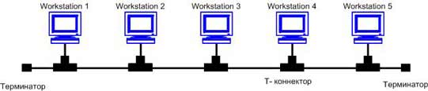
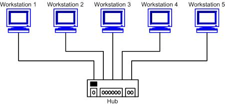
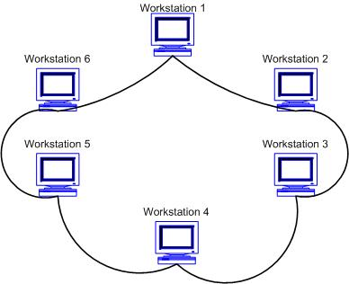
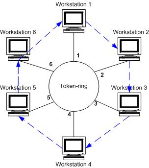
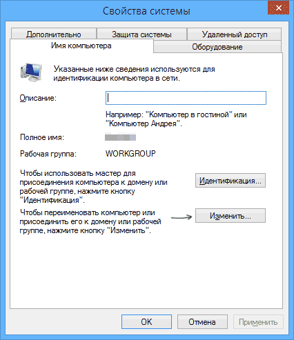
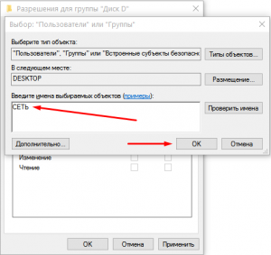

Введение
========

Каждое предприятие в какой-то момент достигает такого этапа расширения, когда нужно выбрать гибкую и прочную систему обмена данными, которую будет просто расширить и изменить в ту сторону, которая в большей степени отвечает потребностям организации. Также, при создании такой системы, обязательно нужно учитывать непрерывное развитие информационных технологий. Именно поэтому, при выполнении данной курсовой работы, я считаю нужным ориентироваться на актуальность технологий сейчас и возможное дополнение системы новинками, чтобы соответствовать требованиям и минимизировать возможные замены частей данной системы.

В данной курсовой работе система обмена данными – это ЛВС, или же – широко распространенная повсеместно известная локальная вычислительная сеть. Применяться данная система будет в многоэтажном здании. При разработке ЛВС в здании такого типа, важнейший момент -это избежание потерь в скорости соединения и четкий порядок соединений сети, чтобы обеспечить максимальную устойчивость и проходимость потоков данных.

Роль ЛВС может оказаться ключевой даже для самого небольшого предприятия. В современном предпринимательстве один из главных ступеней к расширению бизнеса- это организация своей ЛВС. ЛВС создаются для организации делопроизводства, обеспечения безопасности информации, ускорения обмена информацией, упрощения работы за несколькими рабочими станциями одновременно, быстрой архивации цифровых данных, шаблонизации цифровых данных, но, в первую очередь, для создания корпоративных баз данных и поднятия серверов по обработке больших объемов данных.

Есть области, в которых весь предпринимательский проект базируется на компьютерных сетях. Склад с большим объемом предметов на хранении с трудом сможет обойтись без ЛВС. ЛВС в примере заменяет огромное число рабочих, а значит, это - отличное решение для склада, и этому можно привести множество примеров, большинство из них, как правило, связанно с торговлей.

Но для разработки, обслуживания и поддержки ЛВС крайне важны обучение персонала, соответствующее всем современным стандартам и нормам. Также важен обученный пользователь, который сможет четко и уверенно использовать ЛВС по назначению. Для того чтобы не было проблем с обучением пользователей взаимодействию с разработанной системой необходимо документировать каждый компонент. Документация должна быть основным ориентиром при разработке ЛВС.

Возможность модернизации — ключевой параметр ЛВС, на который нужно ориентироваться при проектировании ЛВС. Модернизация так важна, потому, что обновление всей системы, в случае ее статитчности потребуется начинать работу с нуля и все наработки будут утрачены. Это не рационально.

Далее я проанализировал и разработал проект для ЛВС в многоквартирном доме с использованием всех топологий.

Актуальность темы данной работы обусловлена, как выше сказано, повсеместным распространением сетевых технологий: современное предприятие не может функционировать без своей собственной сети. В наши дни многие предприятия расположены в многоэтажных зданиях, особенно, если эти предприятия крупные.

Цель данной курсовой работы – рассмотреть технологию построения ЛВС, спроектировать данную сеть, с учетом различных сетевых топологий: для каждого предприятия может приниматься наиболее эффективная топология, которая обеспечит продуктивное и непрерывное информационное обеспечение организации.

Основные задачи данной работы:

-   рассмотрение принципа работы ЛВС и основных требований к ней;

-   рассмотрение сетевых топологий, применение которых актуально для конкретного предприятия;

-   выбор подходящего сетевого и программного обеспечения для построения сети;

-   обеспечение продуктивной и беспрерывной работы ЛВС.

Глава 1. Теоритическая часть. Проектирование ЛВС в многоэтажном здании с использованием нескольких топологий
=============================================================================================================

Общая характеристика ЛВС
------------------------

Локально-вычислительные сети, или ЛВС — это сети, предназначенные для обработки, хранения и передачи данных, представляющие из себя кабельную систему объекта или группы объектов на выделенном автономном канале связи. Как правило, ЛВС охватывают небольшую территорию: ее диаметр составляет не более 10 км. Локальные вычислительные сети ориентированы на коллективное использование общесетевых ресурсов – аппаратных, информационных и программных.

Назначение локальной информационно-вычислительной сети — обеспечить доступ к разделяемым или общим сетевым ресурсам. Ресурсы могут делится данными, хранить, обрабатывать, производить или собирать информацию. ЛВС создаются для упрощения взаимодействия между рабочими станциями, а также являются платформой для поднятия автономного сервера на предприятии.

Основными компонентами сети являются кабели (передающие среды), рабочие станции, платы интерфейса сети (или сетевые адаптеры), серверы сети.

ЛВС в качестве кабельных передающих сред используются витая пара, коаксиальный кабель и оптоволоконный кабель.

Выделим основные характеристики ЛВС:

-   территориальная протяженность сети (длина общего канала связи);

-   максимальная скорость передачи данных;

-   максимальное число абонентских систем в сети;

-   максимально возможное расстояние между рабочими станциями в сети;

-   сетевая топология;

-   вид физической среды передачи данных;

-   максимальное число каналов передачи данных;

-   тип передачи сигналов (синхронный или асинхронный);

-   метод доступа абонентов к сети;

-   структура программного обеспечения сети;

-   возможность передачи речи и видеосигналов;

-   условия надежной работы сети;

-   возможность связи ЛВС между собой и с сетью более высокого уровня;

-   возможность использования процедуры установления приоритетов при одновременном подключении абонентов к общему каналу.

В зависимости от принципов построения, ЛВС также подразделяются на три типа одноранговые, клиент-сервер и файл-сервер. Рассмотрим два типа, наиболее подходящих для осуществления курсового проекта.

Клиент-сервер

Как правило, компьютеры и программы, которые входят в состав локальной вычислительной сети – не равноправны. Некоторые из них владеют некоторыми ресурсами (например, файловая система, процессор, принтер, база данных и т.д.), другие имеют возможность обращаться к этим ресурсам. Компьютер (или программу), управляющий ресурсом, называют сервером этого ресурса (файл-сервер, сервер базы данных, вычислительный сервер и так далее). Клиент и сервер какого-либо ресурса могут находится как в рамках одной вычислительной системы, так и на различных компьютерах, связанных сетью.

Клиент-сервер - это архитектура или организация построения сети, в которой производится разделение вычислительной нагрузки между включенными в ее состав ЭВМ, выполняющими функции клиентов, и одной мощной центральной ЭВМ — сервером. В частности, процесс наблюдения за данными отделен от программ, использующих эти данные. Например, сервер может поддерживать центральную базу данных, расположенную на большом компьютере, зарезервированном для этой цели. Клиентом будет обычная программа, расположенная на любой ЭВМ, включенной в сеть, а также сама ЭВМ, которая по мере необходимости запрашивает данные с сервера. Производительность при использовании клиент-серверной архитектуры выше обычной, поскольку как клиент, так и сервер делят между собой нагрузку по обработке данных. Другими достоинствами клиент-серверной архитектуры являются: большой объем памяти и ее пригодность для решения разнородных задач, возможности подключения большого количества рабочих станций, включая ПЭВМ (персональные электронно-вычислительные машины) и пассивные терминалы, а также установки средств защиты от несанкционированного доступа (как сети в целом, так и отдельных ее терминалов, баз данных и т. д.).

Основные принципы данной архитектуры заключается в разделении фунций приложений на три группы:

-   ввод и отображение данных (взаимодействие с пользователем);

-   прикладные функции, характерные для указываемой предметной области;

-   функции управления ресурсами (файловой системой, базой даных и т.д.)

Поэтому, в любом приложении выделяются следующие ключевые компоненты:

-   компонент представления данных

-   прикладной компонент

-   компонент управления ресурсом

Связь между компонентами осуществляется по определенным правилам, которые называют "протоколом взаимодействия".

Файл-сервер

Архитектура построения ЛВС, основанная на использовании так называемого файлового сервера — относительно мощной ЭВМ, управляющей созданием, поддержкой и использованием общих информационных ресурсов локальной сети, включая доступ к ее базам данных (БД) и отдельным файлам, а также их защиту. Для поддержки и ведения больших и очень больших БД, содержащих десятки миллионов записей, используются многопроцессорные системы, способные эффективно обрабатывать значительные объемы информации и обладающие хорошим соотношением характеристик и отношения цены к производительности. В отличие от клиент-серверной архитектуры данный принцип построения сети предполагает, что включенные в нее рабочие станции являются полноценными ЭВМ с установленным на них полным объемом необходимого для независимой работы составом средств основного и прикладного программного обеспечения. Другими словами, в указанном случае отсутствуют возможности разделения вычислительной нагрузки между сервером и терминалами сети, характерные для архитектуры типа файл—сервер, и, как следствие, общие стоимостные показатели цены к производительности сети в целом могут быть ниже. Общим недостатком ранних версий разработок средств программного обеспечения отечественных АБИС являлся тот факт, что они были ориентированы только на файл—серверную архитектуру построения вычислительной сети.

Данная архитектура, несмотря на вышеперечисленные недостатки, имеет основное, очень важное с экономической точки зрения, преимущество – низкую стоимость. Подобная архитектура приемлема, когда общее число пользователей сети не превышает 5-10 человек. При увеличении количества пользователей, система может «захлебнуться» из-за перегруженности потоками информации, которую она не может обработать.

Сетевая топология
-----------------

Сетевая топология представляет из себя множество вершин и ребер, математическая модель – граф, в котором вершины обозначают узлы сети (рабочие станции) и коммуникационное оборудование, а ребра это информационные или физические связи между ними. Сетевая топология может быть:

-   Физической.

-   Логической.

-   Информационной.

-   Управления обменом.

Физическая описывает реальное расположение и связи между узлами сети.

Логическая описывает хождение сигнала в рамках физической топологии.

Информационная топология описывает направление потоков информации, передаваемых по сети.

Управления обменом — это принцип передачи права на пользование сетью.

-   Под топологией вычислительной сети понимается способ соединения ее отдельных компонентов (компьютеров, серверов, принтеров и т.д.). Различают три основные топологии:

-   физическая "шина" (bus):

в сети с данной топологией используется линейный моноканал (коаксиальный кабель) передачи данных, на концах которого устанавливаются оконечные сопротивления (терминаторы). Каждый компьютер подключается к коаксиальному кабелю с помощью Т-разъема (или Т - коннектора). Данные от передающего узла сети передаются по шине в обе стороны, отражаясь от оконечных терминаторов. Терминаторы предотвращают отражение сигналов, то есть используются для гашения сигналов, которые достигают концов канала передачи данных.

Таким образом, информация поступает на все узлы, но принимается только тем узлом, которому она предназначается. В топологии логическая шина среда передачи данных используются совместно и одновременно всеми компьютерами сети, а сигналы от компьютера одновременно распространяются по всем напралениям среды передачи. Так как передача сигналов в топологии физическая шина является широковещательной, т.е. сигналы распространяются одновременно во все направления, то логическая топология данной локальной сети является логической шиной

Преимущества сетей шинной топологии:

-   отказ одного из узлов не влияет на работу сети в целом;

-   сеть легко настраивать и конфигурировать;

-   сеть устойчива к неисправностям отдельных узлов.

Недостатки сетей шинной топологии:

-   разрыв кабеля может повлиять на работу всей сети;

-   ограниченная длина кабеля и количество рабочих станций;

-   трудно определить дефекты соединений;

-   физическая “звезда” (star):

в сети построенной по топологии типа “звезда” каждая рабочая станция подсоединяется кабелем (витой парой) к концентратору или хабу (hub). Концентратор обеспечивает параллельное соединение компьютеров и, таким образом, все компьютеры, подключенные к сети, могут общаться друг с другом;

Преимущества топологии:

-   легко подключить новый ПК;

-   имеется возможность централизованного управления;

-   сеть устойчива к неисправностям отдельных ПК и к разрывам соединения отдельных ПК.

Недостатки сетей топологии звезда:

-   отказ хаба влияет на работу всей сети;

-   большой расход кабеля.

-   физическое “кольцо” (ring):

в сети с топологией кольцо все узлы соединены каналами связи в неразрывное кольцо (необязательно, что это окружность), по которому передаются данные. Выход одного компьютера соединяется со входом другого ПК. Начав движение из одной точки, данные, в конечном счете, попадают на его начало. Данные в кольце всегда движутся в одном и том же направлении.

Как правило, в чистом виде топология “кольцо” не применяется из-за своей ненадёжности, поэтому на практике применяются различные модификации кольцевой топологии. Следующая топология является одной из них.

-   физическая "звезда" и логическое "кольцо" (Token Ring):

данная топология основывается на топологии "физическое кольцо с подключением типа звезда". В данной топологии все рабочие станции подключаются к центральному концентратору (Token Ring) как в топологии физическая звезда. Центральный концентратор - это интеллектуальное устройство, которое с помощью перемычек обеспечивает последовательное соединение выхода одной станции со входом другой станции.

Преимущества данной топологии:

-   топология обеспечивает равный доступ ко всем рабочим станциям;

-   высокая надежность, так как сеть устойчива к неисправностям отдельных станций и к разрывам соединения отдельных станций.

Общие требования к ЛВС
----------------------

Помимо основного требования, определяющего назначение ЛВС, а именно возможности доступа к разделяемым ресурсом всех компьютеров сети, существует ряд других требований, которые будут рассмотрены в данном пункте.

Важные требования к ЛВС:

-   Производительность;

-   Надежность;

-   Расширяемость;

-   Масштабируемость;

-   Управляемость.

Показатель производительности сети отражается в следующих характеристиках: время реакции на запрос, пропускная способность сети и задержка передачи.

Первый показатель определяется в интервале между отправкой запроса и получением ответа на него, вторая характеристика - отражение объема переданных данных на единицу времени, третья является разницей поступления сигнала на вход устройства с появлением сигнала на выходе.

Надежность ЛВС выражена в возможности ее использовании для передачи данных без потерь и искажений, а также максимальное обеспечение защищенности данных от несанкционированного воздействия.

Расширяемость и масштабируемость сети позволяет наращивать рабочие места, устанавливать разнообразное программное и аппаратное обеспечение, а также заменять устаревшее оборудование на новое, более мощное без особых затрат, сохраняя работоспособность и производственную мощность ЛВС.

Программное обеспечение ЛВС
---------------------------

Оборудование локальных вычислительных сетей не сможет полноценно осуществлять свои функции без подходящего программного обеспечения.

Программное обеспечение (ПО) – это программы целиком, или части программ, процедур, правил и соответствующей документации системы обработки информации.

К программной части относятся:

Сетевые операционные системы на серверах, составляющие основу любой сети. Именно ОС управляет доступом ко всем сетевым ресурсам, занимается координированием маршрутизации пакетов данных, разрешает конфликты устройств. В таких системах имеется встроенная поддержка протоколов TCP/IP, NetBEUI, IPX/SPX;

Автономные ОС, управляющие клиентской частью. Ими являются обычные операционные системы, к примеру, Windows XP, Windows 7 и так далее;

Сетевые службы и приложения. Эти программные элементы позволяют производить различные действия: просмотр удаленной документации, печать на сетевом принтере, рассылка почтовых сообщений;

Традиционные службы HTTP, POP-3, SMTP, FTP и Telnet являются основой этой категории и реализуются при помощи программного обеспечения.

Глава 2. Практическая часть. Проектирование ЛВС в многоэтажном здании с использованием нескольких топологий
===========================================================================================================

Задача
------

В многоэтажном здании, которое принадлежит «Кроссовки Груп» 12 этажей. Это здание представляет из себя офис в котором одновременно должны быть объединены в сеть 120 электронно вычислительных машин. Потому, что сеть по нормам безопасности должна быть разделена по правам, управлением принято решение создать несколько одноранговых сетей для каждого отдела здания соединеные с сервером и всемирной паутиной:

-   отдел маркетинга

-   отдел продаж

-   отдел дизайна

-   юридический отдел

-   отдел информационных технологий

-   конференс зал

Предприятие давно является внушительным конкурентом на рынке. В 2010 году директор предприятия выпустил приказ отступить от проводной сети в пользу беспроводной. Этого директора уволили, после того, как один молодой сотрудник совершил хакерскую атаку с целью украсть данные, а затем их продать конкурентам. Предприятие остановило работу и потеряло огромную долю денежных средств. После этого новый директор распорядился вернутся к старой технологии. Но чтобы не делать ремонт и менять планировку рабочих мест необходимо максимально экономно и верно подключить машины к локальной сети и к серверу, интернету.

Выбор топологии
---------------

В отделе маркетинга, юридическом отделе и отделе продаж очень много электронно вычислительных машин. Следовательно рекомендуется использовать технологию звезда, чтобы повысить отказоустойчивость. Нам потребуется каждую рабочую станцию подсоедить кабелем (витой парой) к концентратору, или хабу. Концентратор обеспечивает параллельное соединение ПК и, таким образом, все компьютеры, подключенные к сети, могут общаться друг с другом. Данные от передающей станции сети передаются через хаб по всем линиям связи всем ПК. Информация поступает на все рабочие станции, но принимается только теми станциями, которым она предназначается. Так как передача сигналов в топологии физическая звезда является широковещательной, то есть сигналы от ПК распространяются одновременно во все направления, то логическая топология данной локальной сети является логической шиной.

Ключевые причины выбора топологии:

+ легко подключить новый ПК

+ имеется возможность централизованного управления

+ сеть устойчива к неисправностям отдельных ПК и к разрывам соединения отдельных ПК

Но при этом надо учитывать:

+ отказ хаба влияет на работу всей сети

+ большой расход кабеля

В отделе дизайна несколько промышленных графических планшетов. Это модицфицированные ПЭВМ с графическим ПО и графицеским сенсорным дисплеем с пером. В центре комнаты находятся верстаки, на которых создаются прототиппы и макеты будущих кросовок. Из этого следует, что важно, чтобы провода не мешали, а скорость соединения почти не играет роли. В данном отделе будет установленна топология кольцо. Топология кольцо подразумевает, что все узлы соединены каналами связи в неразрывное кольцо, по которому передаются данные. Выход одного ПК соединяется со входом другого ПК. Начав движение из одной точки, данные, в конечном счете, попадают на его начало. Данные в кольце всегда движутся в одном и том же направлении.

Принимающая рабочая станция распознает и получает только адресованное ей сообщение. В сети с топологией типа физическое кольцо используется маркерный доступ, который предоставляет станции право на использование кольца в определенном порядке. Логическая топология данной сети — логическое кольцо. Данную сеть очень легко создавать и настраивать.

К основному недостатку сетей топологии кольцо относится то, что повреждение линии связи в одном месте или отказ ПК приводит к неработоспособности всей сети. Но сеть это не главное в данном отделе, это только вопрос удобства.

В отделе информационных технологий очень небольшое число сотрудников. Расширения штата не планируется. Приоритет в этом отделе это отказоустойчивость и скорость. В данном случае будет применена полносвязная топология. Необходимо чтобы каждая рабочая станция подключена ко всем остальным. Для каждой пары должна быть выделена независимая линия, каждый компьютер должен иметь столько коммуникационных портов сколько компьютеров в сети. По этим причинам сеть может иметь только сравнительно небольшие конечные размеры. Чаще всего эта топология используется в многомашинных комплексах или глобальных сетях при малом количестве рабочих станций. В данном случае тяжело расширить сеть, но по скольку расширение не числится в планах администрации, этот пункт можно пропустить в связи в преимуществах скорости, надежности и простоты.

В конференс зале используется один компьютер и десять мониторов подключенных через wi-fi direct. К сожалению проводной альтернативы у этой технологии нет. Выходом из ситуации будет просто объединение сети к центральному серверу главного компьютера, а мониторы будут и далее получать данные через wifi-direct, так как технология весьма безопасна и по этому каналу не передается конфиденциальной информации.

Настройка ЛВС
-------------

После построения компьютеров в сеть описанную в пункте 2.2 необходимо настроить локальную сеть на ЭВМ с системой Windows 10 Enterprise. Для этого прежде всего, нужно установить одинаковое имя рабочей группы для всех компьютеров, которые должны быть подключены к локальной сети. Откройте свойства «Моего компьютера» &mdash; нажать клавиши Win + R на клавиатуре и ввести команду sysdm.cpl.

Рисунок 1. sysdm

Откроется как раз нужная нам вкладка, в которой можно увидеть, к какой рабочей группе принадлежит компьютер &mdash; WORKGROUP. Для того, чтобы изменить имя рабочей группы, нажмите «Изменить» и задайте новое имя. В нашем случае выберем имя "KROSOVKIGROUP". Имя рабочей группы на всех компьютерах должно совпадать.

Следующим шагом, зайдите в Центр управления сетями и общим доступом Windows (его можно найти в панели управления, либо с помощью правого клика по значку подключения в области уведомлений).

Рисунок 2. Центр управления сетями и общим доступом Windows

Для всех профилей сети включите сетевое обнаружение, автоматическую настройку, общий доступ к файлам и принтерам.

Рисунок 3. Центр управления сетями и общим доступом Windows

Перейдите к пункту «Дополнительные параметры общего доступа», перейдите к разделу «Все сети» и в последнем пункте «Общий доступ с парольной защитой» выберите «Включить общий доступ с парольной защитой» и сохраните изменения.Теперь создадим пользователя, под которым мы будем заходить в общую папку с другого компьютера. То есть пока мы не введем имя этого пользователя и пароль на компьютере с Windows &mdah; в расшаренную папку мы не попадем.

Итак, в Windows щелкаем правой клавишей мыши по значку “Компьютер” на рабочем столе – выбираем “Управление”. Раскрываем слева раздел “Локальные пользователи и группы” – выделаем папку “Пользователи”. В окошке справа щелкаем на пустом месте правой кнопкой мыши – выбираем “Новый пользователь”.

Как предварительный итог: на всех компьютерах локальной сети должно быть установлено одно имя рабочей группы, а также сетевое обнаружение; на компьютерах, папки с которых должны быть доступны в сети, следует включить общий доступ к файлам и принтерам и включить общий доступ с парольной защитой.

Вышеописанного достаточно, если все компьютеры в вашей домашней сети подключены к одному роутеру. При иных вариантах подключения может потребоваться задать статический IP-адрес в одной подсети в свойствах подключения LAN.

В Windows 10 имя компьютера в локальной сети задается автоматически при установке и обычно выглядит не лучшим образом и не позволяет идентифицировать компьютер. Чтобы изменить имя компьютера нужно:

1. Заходим в меню "Пуск" и открываем "Параметры"

2. Заходим в "Система"

3. В левой колонке выбираем "О системе", в правой - "Переименование компьютера"

4. Введите новое имя для компьютера и нажмите "Далее" (рисунок 4)

5. Нажать "Перезагрузить сейчас", чтобы изменения вступили в силу

Рисунок 4. Имя компьютера

Выбор общих папок и открытие доступа
------------------------------------

Итак, чтобы в локальной сети просматривать файлы вашего компьютера, вы должны определить общедоступные папки. Это могут быть несколько папок с фильмами и музыкой, либо целый локальный диск, тогда у вас будет доступ ко всему его содержимому. Безусловно, удобнее, когда общий доступ открыт ко всей файловой структуре. Тогда, какой бы файл вы ни захотели открыть удалённо, вы сможете это сделать. В противном случае, когда общедоступны только некоторые папки, вы ограничены только их содержимым.

1. Откройте Проводник, найдите папку или локальный диск, к которому требуется открыть общий доступ

2. Откройте меню «Свойства» диска

3. Выберите вкладку «Доступ» и кликните «Расширенная настройка» (рисунок 5)

Рисунок 5. Свойства диска

4. Выберете «Открыть общий доступ к этой папке». Кроме того, если нужно, отредактируйте «Имя общего ресурса», название папки будут видеть другие пользователи в сети

5. Далее выберете пункт «Разрешения»

6. Здесь необходимо выставить разрешения доступа пользователям из сети. Нужно добавить новую группу в разрешения.

Рисунок 6. Выбор Пользователя или Группы

7. Выделена группа СЕТЬ. Для отделов нужна возможность удалённого добавления и удаления файлов, редактирования документов, разрешаем «Полный доступ»

Общий доступ открыт, но если открыть файлы настольного ПК с ноутбука, велика вероятность неудачи. Для доступа к «чужим» файлам используется вход в учётную запись пользователя. Необходимо будет ввести имя пользователя и пароль учетной записи целевого компьютера.

