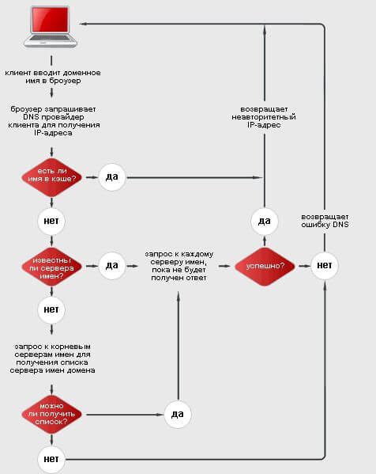

Введение
========

Сегодня абсолютное большинство предприятий всесторонне использует информационные технологии в своей работе: они существенно ускоряют работу предприятия, обеспечивая быстрый, своевременный и, фактически, непрерывный обмен данными в организации. Ключевую роль в обеспечении вышеупомянутых факторов играет грамотно настроенное сетевое обеспечение.

Помимо очевидного объединения компьютеров фирмы в локальную сеть, также применяются и другие технологии, упрощающие работу с IT и позволяющие увеличить продуктивность их использования. Все эти технологии демонстрируют непрерывное развитие IT, позволяют получать от сети не только услуги электронный почты, а все использовать все современные ресурсы Сети.

Существует немало технологий, позволяющих организовать эффективную работу предприятия в сети. Одной из них является технология DNS и DNS-серверы: именно им посвящена данная курсовая работа.

Основное назначение службы доменных имен (DNS &mdash; Domain Name System) состоит в упрощении навигации в Internet для человека, которому символьную последовательность запомнить гораздо легче, чем десяток цифр. Компьютеру же наоборот &mdash; оперировать с числами гораздо легче, да и быстрее. Для разрешения этого противоречия было создано целое семейство различных серверов DNS &mdash; программ, единственной функцией которых является преобразование имен типа www.geocities.com в 123.22.22.11 и наоборот.

Как правило, предприятия пользуются данной технологией, обращаясь к своим провайдерам, чьи DNS-серверы функционируют в режиме авторитетных серверов для пользователей. 

В данной работе будет рассмотрена самостоятельная разработка DNS-сервера для предприятия без обращения к провайдеру. Кроме того, что разработать DNS-сервер довольно несложно, самостоятельное создание DNS-сервера способствует экономии средств предприятия, а также позволяет использовать DNS-технологию более эффективно, что будет рассмотрено в данной работе.

В самом деле, при каждом обращении к удаленному узлу пользователю приходится запрашивать у провайдера IP-адрес, а клиентов у провайдера, как правило, несколько десятков, и на обслуживание запроса уходит драгоценное время.

Собственный DNS-сервер обеспечит максимальный уровень привилегий в обслуживании запросов DNS в виду того, что работает только для одного предприятия, создание базы данных DNS узлов, к которым постоянно обращается мероприятие, а также, что немаловажно, ускорение процедуры установления соединения с серверами Internet.

Также, при помощи DNS можно ограничивать доступ сотрудников к информации, не предназначенной дня них, а также к социальным сетям и другим развлекательным ресурсам.

Тема данной работы выбрана мной потому, что DNS-серверы и эта технология в целом широко распространены, однако далеко не все используют ее рационально и даже не подозревают о преимуществах создания DNS-сервера самостоятельно. Именно поэтому я хочу рассмотреть в данной работе пути реализации данной технологии на предприятии с использованием максимально выгодных для него решений.

Цель работы &mdash; создать корпоративный DNS-сервер для организации, с учетом использования современных технологий, соответствующих современному уровню развития IT.

Задачами работы являются:

+ Рассмотрение принципа работы технологии DNS

+ Ознакомление с классификацией DNS-серверов

+ Получение практических навыков в создании DNS-сервера

Глава 1. Теоретическая часть. DNS-сервер
========================================

Технология DNS
--------------

Практически каждый пользователь, подключая свой компьютер к Сети, получает от своего провайдера личный IP-адрес (например 63.141.33.125 или 179.23.45.216) и, зачастую, не вникает в суть и назначение группы цифр, которые и называются IP. Но не зная IP-адрес компьютера, из Сети будет невозможно послать ему информацию или ответить на запрос. Например, невозможно будет пользоваться поисковыми системами. Если такое происходит, говорят упал DNS.

Чтобы получить информацию с какого-либо сайта, прежде соединившись с ним, нужно знать его IP-адрес. Но человеку невозможно запомнить большое количество чисел, это просто не удобно.  

Вот именно потому разработчики придумали систему доменных имен (DNS). Разработана эта система была Полом Мокапетрисом еще в 1983 году.

DNS или Domain Name System — система доменных имён — компьютерная распределённая система для получения информации о доменах, которая чаще всего используется для получения IP-адреса по имени хоста (компьютера или устройства), получения информации о маршрутизации почты, обслуживающих узлах для протоколов в домене.

Работа DNS довольно проста, но из-за незнания её основ возникает основная масса проблем и вопросов при переносе существующего доменного имени и регистрации нового.

Прежде всего, следует определить, что такое домен или доменное имя. Оно присваивается сайтом. Собственно — это и есть IP-адрес сайта, который записан в буквенно-цифровом формате, а не просто в цифровом (например: http://meow.ru или http://www.purrrcat.com).

DNS выступает в роли средства, которое позволяет определить IP-адрес по доменному имени (так называемый резолвинг доменного имени). Разумеется, доменное имя должно быть делегировано. 

Один, два и даже группа серверов не смогла бы переварить огромное количество запросов, которое ежедневно генерирует все пользователи Интернетом. Поэтому была построена иерархическая система, состоящая из групп серверов. Каждая группа серверов в этой иерархии отвечает за определенную часть доменного имени.

Возьмем в пример ситуацию с доменным именем http://meow.kiss.me. Сначала запрос идет к корневому серверу, который не знает ничего об этом домене, но знает IP-адрес того сервера, который отвечает за зону me.

Затем запрос направляется к DNS-серверу, который отвечает за зону me. Но этот первый сервер может только назвать нам IP-адрес сервера, отвечающего за зону kiss.me, после запроса к нему мы получаем адрес того сервера, который отвечает за зону meow.kiss.me, после этого можно будет узнать, какой IP-адрес соответствует разбираемому нами доменному имени. В данной ситуации отлично просматривается иерархическое построение DNS-технологии.

Подобное устройство DNS позволяет равномерно распределить нагрузки на все DNS-сервера сети, максимально децентрализовав систему. Используя дополнительно к этому еще и систему кэширования ответов DNS-серверов, можно существенно снизить нагрузку на них.

Рисунок 1. Схема работы ДНС

DNS-серверы и их виды
---------------------

DNS-сервер &mdash; это приложение, которое предназначено для ответов на DNS-запросы по соответствующему протоколу. Это - аппаратно-программный комплекс, преобразующий и приводящий в соответствие буквенное обозначение адресов сайтов к их числовому IP обозначению и наоборот.

Второстепенная задача DNS-серверов &mdash; это составление баз данных, в которых хранятся все доменные имена и IP-адреса, соответствующие им. DNS-серверы связаны друг с другом и постоянно поддерживают связь, и, если хотя бы один из серверов выходит из строя, его функции на себя берет ближайший «сосед».

В классификации DNS-серверов обычно выделяют два параметра: функции, которые выполняет сервер, и типы зон DNS.

Для дальнейшего понимания системы доменных имён нужно узнать, что такое DNS-зона.

С конкретным доменным именем может быть связан не только веб-сайт, но и, например, почтовый сервер. И у них могут быть разные адреса. 

Одному и тому же домену может соответствовать веб-сайт или почтовый сервер, у каждого из которых может быть несколько IP-адресов, используемых для повышения надёжности и производительности сайта или почтовой системы. Все необходимые связи между доменным именем и IP-адресами отражены в специальном файле, который расположен на DNS-сервере. Содержимое этого файла называют описанием DNS-зоны, или просто DNS-зоной.

По функциям выделим следующие виды DNS-серверов:

+ Авторитативный &mdash; сервер, отвечающий за определенную зону. Такой DNS-сервер состоит из первичных и вторичных серверов, то есть, в каждой зоне существует один сервер, который можно также назвать «мастер сервер», и неограниченное количество вторичных, или «слейв-серверов»;

+ Кэширующий DNS - отвечает за обслуживание запросов DNS-клиентов. Это - специальные программы, работающие с адресами сетевых узлов.  К кэширующему DNS можно отнести локальный DNS-сервер, отвечающий за запросы внутри локальных сетей и приложений;

+ Перенаправляющий &mdash; вспомогательный вид DNS-серверов, «разгружает» кэширующий сервер, перераспределяя запросы, таким образом облегчая его работу;

+ Корневой &mdash; сервер, который отвечает за корневые зоны, которых в мире существует всего 13: их имена находятся в зонах от a.root-servers.net до m.root-servers.net;

+ Регистрирующий - работает непосредственно с запросами пользователей, сопоставляет доменные имена с IP-адресами;

+ DNSBL - дословно расшифровывается как черный список DNS-серверов.

Если классифицировать DNS-сервера по зонам, то здесь найдется только два вида: сервера, работающие в зонах прямого или в зонах обратного преобразования, то есть, из доменного имени в IP и наоборот.

DNS &mdash; запросы
-------------------

DNS-запрос — запрос от клиента (или сервера) серверу. Такие запросы могут быть рекурсивными, то есть, требовать полного поиска, или нерекурсивным, соотвественно, не требующий оного. Также существуют обратные запросы.

Нерекурсивный или итеративный запрос &mdash; запрос при котором клиент сам совершает опрос DNS серверов. При ответе на нерекурсивный запрос, в случае неумения или при запрете выполнения рекурсивных запросов, DNS-сервер либо возвращает данные о зоне, за которую он ответственен, либо показывает ошибку.

Рекурсивным называют запрос, при котором клиент передает задание на поиск IP-адреса серверу. При рекурсивном запросе, DNS-сервер опрашивает серверы (в порядке убывания уровня зон в имени) до тех пор, пока не найдёт ответ или не обнаружит, что домен не существует.

Рекурсивные запросы требуют больше серверных ресурсов и создают больше трафика, так что, как правило, принимаются от «известных» владельцу сервера узлов (например, провайдер дает возможность делать рекурсивные запросы только своим клиентам, в корпоративной сети рекурсивные запросы принимаются только из локального сегмента). 

Нерекурсивные запросы обычно принимаются ото всех узлов сети (и содержательный ответ даётся только на запросы о зоне, которая размещена на узле, на DNS-запрос о других зонах обычно возвращаются адреса других серверов).

Под обратным запросом DNS понимается особая доменная зона, предназначенная для определения имени узла по его IP-адресу c помощью PTR-записи. Адрес узла (например, AAA.BBB.CCC.DDD) переводится в обратной нотации и превращается в DDD.CCC.BBB.AAA.in-addr.arpa. Благодаря иерархической модели управления именами, появляется возможность делегировать управление зоной владельцу диапазона IP-адресов. Для этого в записях авторитетного DNS-сервера указывают, что за определенную зону отвечает отдельный сервер.

PTR-запись связывает IP хоста с его каноническим именем. Запрос в домене in-addr.arpa на IP хоста в обратной форме вернёт имя данного хоста.

В целях уменьшения объёма нежелательной почтовой корреспонденции (спама), многие почтовые серверы могут проверять наличие PTR записи для хоста, с которого происходит отправка. В этом случае PTR запись для IP адреса должна соответствовать имени отправляющего почтового сервера, которым он представляется в процессе сессии.

Ресурсные записи DNS
--------------------

Ресурсные записи DNS — записи о соответствии имени и служебной информации в системе доменных имён.

Наиболее популярны следующие типы ресурсных записей:

Запись A (address) — адресная запись, которая необходима для связи домена и IP-адреса сервера;

CNAME (Canonical name) — каноническое имя для псевдонима. Запись CNAME чаще всего используется для переадресации поддомена на другой домен. Одновременно добавить запись CNAME и запись A для одного и того же поддомена невозможно;

MX (Mail Exchanger) — адрес почтового шлюза для домена, состоящий из двух частей — приоритета и адреса узла. Записи MX критически важны для работы почты. Благодаря им, отправляющая сторона «понимает» на какой сервер нужно отправлять почту для вашего домена. При введении адреса сайта в строку браузера, именно по записи A служба доменных имён определяет, с какого сервера нужно открывать сайт. Записей MX может быть несколько, чтобы в случае недоступности одного из почтовых серверов, почта была все же отправлена на другой. Приоритет записи определяет, на какой сервер нужно отправлять почту в первую очередь. Если приоритет одинаковый, сервер выбирается случайным образом;

NS (Authoritative name server) — адрес узла, отвечающего за доменную зону. Эта запись указывает, какие DNS сервера хранят информацию о домене. Критически важна для работы службы DNS.

Запись, о которой уже говорилось в данной работе: PTR - DNS запись, связывающая IP-адрес сервера с его каноническим именем (доменом).

SOA (Start of Authority) — запись, которая указывает, на каком сервере хранится эталонная информация о доменном имени. Критически важна для работы службы DNS.

SPF (Sender Policy Framework) — указывает сервера, которые имеют полномочия отправлять почту от имени домена. Запись SPF вносят в TXT-запись домена.

TXT (Text string) — содержит любую текстовую запись. Широко применяется для проверок на право владения доменом при подключении дополнительных сервисов, а также для записи SPF и ключа DKIM. Записей TXT может быть сколько угодно. 

Уязвимости DNS
--------------

DNS &mdash; один из самых критичных компонентов сети Интернет, поэтому, очевидно, уязвимости в серверах доменных имен всегда вызывали повышенный интерес у злоумышленников.

Изначально, при разработке DNS или любого программного обеспечения для развёртывания в раннем Интернете вопросы безопасности не учитывались в должной степени, но и сети в то время были закрыты от широкой аудитории. Рост Интернета в коммерческом секторе в 1990-х годах изменил требования к мерам безопасности для защиты целостности данных и аутентификации пользователей.

Одной из проблем DNS является отравление кэша DNS, в котором данные распространяются на кэширующие преобразователи под предлогом того, что они являются авторитетным сервером происхождения, тем самым загрязняя хранилище данных потенциально ложной информацией и длительными сроками действия (время жизни). Впоследствии, запросы легитимных приложений могут быть перенаправлены на сетевые хосты, контролируемые злоумышленником.

DNS-ответы ранее не имели криптографической подписи, что давало возможность для множества вариантов атаки. Современные расширения системы безопасности доменных имен (DNSSEC) изменяют DNS, чтобы добавить поддержку криптографически подписанных ответов. Другие расширения, такие как TSIG, добавляют поддержку криптографической аутентификации между доверенными одноранговыми узлами и обычно используются для авторизации передачи зоны или операций динамического обновления.

Некоторые доменные имена могут использоваться для достижения эффектов спуфинга. Например, paypal.com и paypa1.com - это разные имена, но пользователи могут не различать их в графическом пользовательском интерфейсе в зависимости от выбранного шрифта пользователя. Во многих шрифтах буква l и цифра 1 выглядят очень похожими или даже идентичными. Эта проблема остро стоит в системах, которые поддерживают интернационализированные доменные имена, поскольку многие коды символов в ISO 10646 могут отображаться на типичных экранах компьютеров. Эта уязвимость иногда используется в фишинге.

Выделим основные тезисы об уязвимостях DNS:

+ Отравление кеша DNS сервера может производиться весьма быстро (5-10 секунд);

+ Злоумышленник может изменить данные, уже находящихся в кеше сервера

+ Уязвимость может использоваться как против сервера имен, так и против рабочей станции.

Целью атаки может быть любой промежуточный DNS-сервер на пути к авторитетному серверу или DNS клиент. Значит, если вышестоящий DNS сервер уязвим, то риску подвержены все управляемые им серверы.

Глава 2. Практическая часть. DNS-сервер
=======================================

