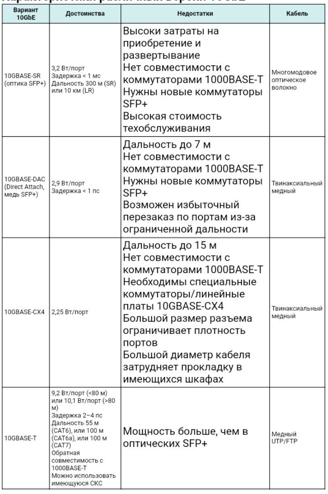

Введение
========

Сегодня невозможно представить мир без компьютерных сетей: они обеспечивают непрерывный информационный обмен между людьми во всем мире, по факту, играя ключевую роль в формировании современного Информационного общества. Они настолько плотно связаны с нашей жизнью, что мы привыкли не замечать их, и даже не задумываемся, насколько они облегчают нашу жизнь, охватывая все сферы человеческой деятельности.

В предпринимательской среде без грамотно организованной сети невозможно функционирование успешной организации.

На сегодняшний день трудно представить работу современного офиса без локальной вычислительной сети (ЛВС, LAN – Local Area Network), без информационно-вычислительной сети сейчас не обходится ни одно предприятие.

Сеть предприятия предназначена для организации для совместного доступа к данным, программам и оборудованию. У коллектива людей, работающего над одним заданием, появляется возможность работать с одними и теми же данными и программами не по очереди, а одновременно, и это без всякого сомнения уменьшает сроки выполнения того или иного задания, обусловленного нуждами предприятия, облегчает работу сотрудников.

Локальная сеть также обеспечивает выполнение административной функции. Контролировать ход работ над проектами в сети проще, чем иметь дело с множеством автономных компьютеров.

Локальные сети и все, что связано с ними, тесно соприкасаются с технологией Ethernet. Ethernet (эзернет, от лат. aether — эфир) — пакетная технология компьютерных сетей, локальных - преимущественно. 

В наши дни она используется при решении самых разных задач: от подключения терминальных устройств и базовых станций сотовой связи до организации суперскоростных магистралей.

Стандартами Ethernet определяются и реализуются проводные соединения и электрические сигналы на физическом уровне, формат кадров и протоколы управления доступом к среде — на канальном уровне модели OSI, на которой базируется основное большинство ЛВС. 

В стандарте первых версий (Ethernet v1.0 и Ethernet v2.0) указано, что в качестве передающей среды используется коаксиальный кабель, в дальнейшем появилась возможность использовать кабель витая пара и кабель оптический.

Став самой распространенной технологией ЛВС в 90-х годах прошлого столетия, Ethernet-технология продолжала развиваться, разрабатывая новые стандарты, беря во внимание возрастающие требования к полосе пропуская - скорости передачи информации. Данные требования, в свою очередь росли из-за повсеместного, глобального внедрения ЛВС и возложения на них все новых и новых задач.

Если рассматривать частные случаи, с течением времени, объем информации, получаемый, передаваемый, обрабатываемый предприятиями возрастает, и очень важно, чтобы сеть предприятия могла выдержать увеличивающуюся нагрузку. Также, некоторым предприятиям, работающим с большими объемами данных, которые нежелательно подвергать сжатию, нуждаются в более высокой скорости передачи информации, чтобы ускорить ее обработку, и, следовательно, работу фирмы. Так появился «гигабитный Ethernet»

В 2006 году был принят стандарт 10 Gigabit Ethernet: это, по сравнению с начальными версиями технологии, можно назвать настоящим прорывом, так как скорость обработки информации при использовании данной технологии можно справедливо назвать сверхвысокой.

В нашей стране данная технология пока не очень широко используется предприятиями: впрочем, многие до сих пор не используют даже «простой» одногигабитный Ethernet, и скорость передачи данных все еще измеряется в мегабитах. Я считаю это большим упущением, потому что, учитывая современные тенденции развития бизнеса и информационных технологий, организации нуждаются в средствах реализации высокоскоростной работы с данными. 10 Gigabit Ethernet может существенно повысить эффективность работы предприятия, которое, в первую очередь, работает с большими объемами информации: например, профессиональные фото-видео мастерские, которые для удобной обработки материала и своевременного выполнения обязательств перед заказчиками должны иметь сеть с высокой полосой пропускания. Тем более, ко всему прочему, 10 Gigabit решения уже можно назвать «устаревшими», ведь уже вышел стандарт данной технологии для скорости 40 гигабит.

Я выбрала данную тему для курсовой работы потому, что, как сказано выше, считаю игнорирование данной технологии незаслуженным, и хочу показать в этом проекте, насколько можно реализовать потенциал 10 Gigabit Ethernet.

Цель данной работы – спроектировать ЛВС здания с использованием вышеупомянутой технологии, учитывая современные потребности организации к сети, в том числе, и с точки зрения финансовой выгоды.

Задачи курсовой работы:

- Получить общее представление о локальных вычислительных сетях;

- Провести обзор технологии 10 Gigabit Ethernet;

- Узнать о ее преимуществах и недостатках;

- Рассмотреть пути реализации данной технологии в ЛВС;

- Получить общие практические навыки в построении ЛВС.

Глава 1. Теоретическая часть. Локальные вычислительные сети
===========================================================

Общая информация об ЛВС
-----------------------

Локально-вычислительные сети, или ЛВС — это сети, предназначенные для работы с данными, которые представляют из себя кабельную систему объекта или группы объектов.  Как правило, ЛВС охватывают небольшую территорию: ее диаметр составляет не более 10 км. Локальные вычислительные сети ориентированы на коллективное использование общесетевых ресурсов – аппаратных, информационных и программных.

Назначение локальной информационно-вычислительной сети — обеспечить доступ к разделяемым или общим сетевым ресурсам. Ресурсы могут делится данными, хранить, обрабатывать, производить или собирать информацию. 

Основными компонентами сети являются кабели (передающие среды), рабочие станции, платы интерфейса сети (или сетевые адаптеры), серверы сети.

ЛВС в качестве кабельных передающих сред используются витая пара, коаксиальный кабель и оптоволоконный кабель.

Основные характеристики ЛВС:

- территориальная протяженность сети (длина общего канала связи);

- максимальная скорость передачи данных;

- максимальное число абонентских систем в сети;

- максимально возможное расстояние между рабочими станциями в сети;

- сетевая топология;

- вид физической среды передачи данных;

- максимальное число каналов передачи данных;

- тип передачи сигналов (синхронный или асинхронный);

- метод доступа абонентов к сети;

- структура программного обеспечения сети;

- возможность передачи речи и видеосигналов;

- условия надежной работы сети;

- возможность связи ЛВС между собой и с сетью более высокого уровня;

- возможность использования процедуры установления приоритетов при одновременном подключении абонентов к общему каналу.

Общие требования к ЛВС
----------------------

Главное требование к локальной вычислительной сети - выполнение сетью ее основной функции - обеспечение пользователям потенциальной возможности доступа к разделяемым ресурсам всех компьютеров, объединенных в сеть. 

Все остальные требования тесно связаны с качеством выполнения этой основной задачи.

Производительность – данное свойство обеспечивается возможностью распараллеливания работ между несколькими компьютерами сети. Существуют следующие основные характеристики производительности сети:

- время реакции

- пропускная способность

- задержка передачи 

- вариация задержки передачи

Время реакции сети - характеристика производительности с точки зрения пользователя. В общем случае, время реакции определяется как интервал времени между возникновением запроса пользователя к какой-либо сетевой службе и получением ответа на этот запрос.

Пропускная способность показывает объем данных, переданных сетью или ее частью за единицу времени. 

Задержка передачи - задержка между моментом поступления пакета на вход какого-либо сетевого устройства или части сети и моментом появления его на выходе этого устройства.

Надежность ЛВС определяется следующими показателями: 

1. отовностью или коэффициентом готовности (availability), который означает долю времени, в течении которого система может быть использована. Вероятностью доставки пакета узлу назначения без искажений (вероятность потери пакета, вероятность искажения отдельного бита передаваемых данных, отношение потерянных пакетов к доставленным)

2. Способностью системы защитить данные от несанкционированного доступа (безопасностью).

3. Отказоустойчивость (fault tolerance) - способностью скрыть от пользователя отказ отдельных элементов сети.

4. Расширяемость (extensibility) означает возможность сравнительно легкого добавления отдельных элементов сети (пользователей, компьютеров, приложений и служб), наращивая длины сегментов сети и замены существующей аппаратуры более мощной.

5. Масштабируемость (scalability) означает, что сеть позволяет наращивать количество узлов и протяженность связей в очень широких пределах, при этом производительность сети не ухудшается.

6. Прозрачность (transparency) сети достигается в том случае, когда сеть представляется пользователям не как множество отдельных компьютеров, связанных между собой системой кабелей, а как единая традиционная вычислительная машина с системой разделения времени.

7. Поддержка разных видов трафика - сеть должна обеспечить совместную передача традиционного компьютерного и мультимедийного трафика (в том числе видео и речи).

8. Управляемость отражает возможность централизованно контролировать состояние основных элементов сети, выявлять и разрешать проблемы, возникающие при работе сети, выполнять анализ производительности сети и планировать ее развитие.

9. Совместимость или интегрируемость говорит о способности сети включать в себя самое разнообразное программное и аппаратное обеспечение, то есть в ней могут сосуществовать различные операционные системы, поддерживающие различные стеки коммуникационных протоколов, и работать аппаратные средства и приложения от различных производителей.

Технология 10 Gigabit Ethernet
------------------------------

10 Gigabit Ethernet (10GE, 10GbE, or 10 GigE) – совокупность технологий, позволяющий передавать Ethernet-кадры со скоростью10 гигабит в секунду. Данная технология обусловлена стандартом IEEE 802.3ae-2002 и была введена, как следует из названия стандарта, в 2002 году. 

В отличии от предыдущих стандартов своего семейства, в 10 Gigabit Ethernet применяется только дуплексная передача данных типа point-to-point, полудуплексная передача данных, как в предыдущих технологиях этой группы, не поддерживается, и в режиме CSMA/CD нет необходимости. Следовательно, в сетях исключается использование концентраторов (хабов).

Стандарт 10GbE на физическом уровне модели OSI позволяет расстояние передачи данных до 40 км по одномодовому волокну, а также обеспечивает совместимость с сетями синхронной цифровой иерархии (SDH) и фотонными сетями.

Функционирование на 40-километровом расстоянии, скорость передачи до 10 гигабит в секунду и совместимость с системами SDH делает технологию 10GbE не только технологией локальных, но и технологией глобальных сетей., следовательно, стандарт развивается не только для LAN, но также для MAN и WAN. 

Принимали 10 Gigabit Ethernet более постепенно, чем предыдущие версии Ethernet: в 2007 году был введен один миллион портов 10GbE, в 2009 году было реализовано два миллиона портов, а в 2010 году - более трех миллионов портов, прогнозируя 9 миллионов портов в 2011 году. По состоянию на 2012 год, хотя цена за гигабит полосы пропускания для 10 Gigabit Ethernet составляла около одной трети по сравнению с Gigabit Ethernet, цена за порт 10 Gigabit Ethernet по-прежнему препятствовала более широкому распространению, что мы видим и по сей день.

Техническая реализация порта 10GbE может быть различной: от портов для медных кабелей UTP/STP (неэкранированные/экранированные витые пары) нового поколения (вплоть до повторного использования имеющейся кабельной инфраструктуры 1GbE) до твинаксиальных (двойных коаксиальных) медных проводников новой инфраструктуры или многомодовых волоконно-оптических линий. Выбор технической реализации зависит от задачи сети и ее протяженности.

Выбор подхода реализации 10 Gigabit Ethernet
--------------------------------------------

Как упоминалось выше, способов реализации описываемой мной технологии- достаточно много, чтобы выбирать. Выбор зависит исключительно от того, какие требования к соединению есть у пользователя.

С помощью таблицы сравнительных характеристик отметим различие подходов реализации в разных видах технологии 10 Gigabit Ethernet.

Рисунок 1. Сравнительные характеристики

Рассмотрев характеристики, приведенные в таблице, делаем вывод, что каждая разновидность 10 Gigabit Ethernet имеет свои недостатки и преимущества, а потому, нужно четко поставить задачу для сети и выбрать подходящую технологию.

Например, для небольших и средних локальных сетей наиболее привлекателен вариант 10GBASE-T (официальное название IEEE 802.3an-2006) на обычных медных витых парах категории CAT6 и выше. Хотя следует отметить, что в сравнении с другими вариантами 10GbE здесь возрастает рассеиваемая мощность на порту, что ранее было основным препятствием для широкого распространения 10GbE в коммутаторах нижнего ценового диапазона.

Преимущества 10GBASE-T:

Именно «медный» вариант 10GBASE-T обещает наибольшую гибкость, наименьшую стоимость среды передачи и обратную совместимость с имеющимися сетями 1GbE.

10GBASE-T позволяет работать на расстоянии до 100 м, что обеспечивает охват практически любого ЦОД и оставляет разработчикам возможность выбора для ЦОД любой из схем взаимного размещения серверов и коммутаторов, включая не только классическую архитектуру ToR (Top of Rack, коммутатор для стойки) с ограничением медной проводки внутри стойки, но и MoR (Middle of Row, в середине ряда) вместе с EoR (End of Row, в конце ряда), когда агрегирующие коммутаторы располагаются в определенном месте ряда стоек, вне стойки «своих» серверов.

Для кабельных систем нового поколения (категории 6A и выше) технология 10GBASE-T может использоваться в режиме пониженной мощности («зеленый» режим энергосбережения или режим ЦОД), когда дальность составляет менее 30 м. В некотором смысле 10GBASE-T повторяет историю 1000BASE-T: ведь первые гигабитные микросхемы характеризовались потреблением примерно 6,5 Вт/порт, но мощность снижалась с каждым новым поколением, и сегодня порт GbE имеет мощность менее 1 Вт. Аналогичный процесс наблюдается для спецификации 10GBASE-T, физический уровень которой четко следует эмпирическому закону Мура, результатом чего становится планомерное снижение мощности и стоимости. В 2008 г. первые адаптеры 10GBASE-T требовали 25 Вт/порт, затем потребляемая мощность сократилась до 10 Вт/порт, а в 2011 г. упала ниже 5 Вт на порт 10GBASE-T, что позволяет применять эту технологию не только в коммутаторах с высокой плотностью портов, но и на системных платах серверов.

Снижение потребляемой мощности сопровождается уменьшением стоимости: цена адаптеров 10GBASE-T первого поколения составляла примерно 1000 долл. за порт, сегодня двухпортовый адаптер 10GBASE-T третьего поколения стоит примерно 200–300 долл. за порт, а в новых коммутаторах Netgear этот показатель практически приблизился к отметке 100 долл. за порт.

Не менее важным фактором является обратная совместимость с 1000BASE-T, дающая возможность повторно использовать имеющуюся кабельную инфраструктуру 1GbE (CAT6, CAT6A и выше), что позволяет сократить затраты на миграцию с 1 Гбит/с на 10 Гбит/с.

В зависимости от размера пакета задержка в 1000BASE-T составляет от долей микросекунды до 12 мкс и выше. Для 10GBASE-T диапазон задержек составляет от 2 до 4 мкс. В общем случае для пакетов большого размера задержка 10GBASE-T более чем в 3 раза меньше задержки 1000BASE-T для пакетов одного размера и типа.

Технология 10GBASE-T присутствует сегодня практически во всех сегментах рынка профессионального сетевого оборудования:

- коммутаторах фиксированной конфигурации (fixed switch или box switch), включая 40-, 32- и 24-портовые;

- модульных коммутаторах на основе шасси, включая карты со средней плотностью портов (от 8 до 16 портов на съемный модуль) и с высокой плотностью портов (более 16 портов на съемный модуль);

- сетевых интерфейсных картах (NIC) или сетевых модулях для системных плат LOM (LAN on motherboard), включая модули коммутаторов для плоских стоечных серверов (blade server); а также одно- и двухпортовые платы 10GBASE-T NIC;

- устройствах iSCSI в массивах хранения данных с портами 10GBASE-T.

В результате технология 10GBASE-T, естественно, используется большинством поставщиков сетевого оборудования, но ее поддержка именно на входных коммутируемых портах, а не только на портах стекирования или агрегации трафика, весьма сильно различается у основных изготовителей сетевых коммутаторов.

Глава 2. Практическая часть. DNS-сервер
=======================================

